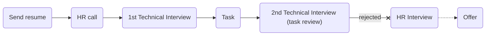

# [digikala](https://digikala.com)
### Python developer (Digicloud)
### Interview process

## 1st interview

 خودت رو معرفی کن

- What is abc?

- What is decorator? and what feature python have that help decorator functionallity?

- What is django architecture? what is MVT?

- What is DI?

- Can we inherit from multiclasses in python? what algorithm behind it?

- What is list comprehension?

- What is SOLID?

- What is design pattern and which design pattern do u used?

- What is microservice? ...

- How can solve latency between our services in microservice architecture? how protect for loss data....

- Databases how in microservice arch?

- What is ACID?

- scenario

- What is RPC?

- How much do u work for DevOps stuffs?

- What is your git workflow?

- What is async and parallelism?

## 2nd interview
### Task
[this](./DigiCloud_Programming_Challenge.pdf)
And my answer

### Score
#### 8.5/10

TODO
