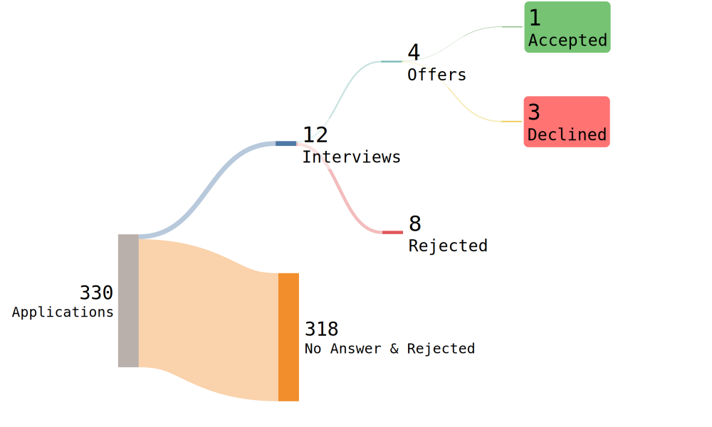

<h1>Jobname | جاب‌نامه</h1>

<h2 id="toc" dir="rtl"><a class="header" href="#toc">فهرست</a></h2>
<ul dir="rtl">
    <li><a href="#intro">دیباچه</a></li>
    <li><a href="#companies">شرکت‌ها</a></li>
    <li><a href="#statistics">نگاه آماری</a></li>
    <li><a href="#refer">ریفر، میفر، مایکروفر</a></li>
</ul>

<h2 id="intro" dir="rtl"><a class="header" href="#intro">دیباچه</a></h2>

اینجا قصد دارم تجربیاتی که چند سال اخیر از مصاحبه‌ها با شرکت‌های ایرانی داشتم رو، منتشر کنم. اولش خیلی به نظرم مسخره و پوینت‌لِس می‌اومد تا این که دیدم همه ما تجربیاتی تو زندگی داریم که پس از پشت سر گذاشتن اون‌ها یا فراموش‌شون می‌کنیم یا اون‌قدر جدی نمی‌گیریم تا بتونیم ازشون استفاده کنیم یا گاهی اصلا امکان فرصت تجربه دوباره‌ش نیست و شاید اگه با بقیه در میون بذاریم، فقط به اونا می‌تونیم کمک کنیم و یا همین که آنچه که بر تو گذشته رو می‌نگاری، به تنهایی کافی‌ست! از روزگاران بسیار دور تا به امروز، این متن بوده که ماندگار بوده و به مثابه زندانی‌ای که هر روز در انفرادی به سر می‌بره‌ و هیچ امیدی نداره و سعی می‌کنه روزهاش رو بیاره رو کاغذ و سال‌ها بعد ازش فیلم و سریال می‌سازند و یادش می‌کنند، گاهی راه چاره قلمه. مخلص کلام؛ نوشتن تجربیات خوب است.
 
می‌نویسم پس هستم!
  
سعی کردم تا حد ممکن به شکل دقیق، موشکافانه و به دور از غرض‌ورزی و سوگیری، به همراه جزئیات، در مورد مصاحبه‌‌هایی که داشتم، فارغ از این که چه شرکتیه و چی کار می‌کنه، فقط نسبت به همون اتفاقاتی که بین من و اون‌ها رخ داده، قضاوت کنم و نظر بدم. از طرفی، دیدم که پلتفرم قوی و درست و حسابی‌ای که مرجع باشه یا حتی مفید باشه و دیتای به‌روز داشته باشه، نگاهی منطقی و به دور از احساسات داشته باشه و دید صفر و یکی نداشته باشه، عملا وجود نداره. اشتراک تجربه در سوشال‌مدیاها نیز به شکل پراکنده و پخش و پلاست و باز هم چیزی که می‌خواستم رو برآورده نمی‌کرد. مدت‌ها، قبل این که سرمو رو بالش بذارم، این کرم تو سرم بود تا این که سایت خودمو بالا آوردم و «جاب‌نامه» به وجود اومد. امیدوارم مفید واقع بشه. هدف اصلیم، مشارکت شما در این پروژه‌ست که اگه پر و پیمون بشیم، به هم بیش‌تر کمک می‌کنیم و با هم رشد می‌کنیم.

<h2 id="companies" dir="rtl"><a class="header" href="#companies">شرکت‌ها</a></h2>

- [exa](./exalab.md)
- [phanous](./phanous.md)
- [gharar](./gharar.md)
- [Digikala](./digikala/README.md)
- [Snapp](./snapp/README.md)
- [Snapp Market](./snapp/snapp-market.md)
- [Yektanet](./yektanet.md)
- [Wallex](./wallex.md)
- [Graph](./graph/README.md)
- [Golrang-ozon](./golrang-ozon.md)
- [Hamkaran system](./hamkaran-system.md)
- [Hamravesh](./hamravesh/hamravesh.md)
- [Hermes](./hermes.md)
- [Sternx](./sternx.md)
- [Quiz of Kings]()
- [Narvan](./narvan.md)
- [siztel](./sizetel.md)
- [cpol](./cpol.md)
- [Dadeh Afzar Arman](./daa.md)
- [MH holding](./mhholding.md)
- [itool](./itool.md)
- [autoshenas](./autoshenas.md)

 
 

<h2 id="statistics" dir="rtl"><a class="header" href="#statistics">نگاه آماری</a></h2>

 

<strong>Application Count</strong>

این، مربوط به مصاحبه‌های سال ۱۴۰۲ بین بازه آبان تا اسفند (۵ ماه) است. رکورد جالبیه!

 
 

<iframe src="./assets/interview_platform.html" style="border:none;" width="600 px" height="400 px"></iframe>

از ۲۲ شرکت که به مصاحبه کشیده شده.

 
 

<iframe src="./assets/apply_way.html" style="border:none;" width="600 px" height="400 px"></iframe>

نمودار حاصل از ۲۴ شرکتی که اپلای شده و حداقل یک مرحله به جلو رفته.

<h2 id="refer" dir="rtl"><a class="header" href="#refer">ریفر، میفر، مایکروفر</a></h2>

نمی‌دونم شما چی بهش می‌گی؟ ریفر، کانکشن، رابطه، آشنا، باند یا پارتی. هر چی که هست، خوب یا بد، بخوای یا نخوای، همین است و بس! بقیه‌ش نویزه. حالا یعنی چی؟ شما دنبال کاری و خب می‌ری از یه جا به شرکتایی که نیازمندیاش بهت می‌خوره، اپلای می‌کنی که خب باید منتظر باشی.   راه درستش اینه که چهارتا آدم پیدا کنی که تو رو معرفی کنن به شرکتاشون. حالا این آدما می‌تونن دوست، رفیق، زید، پارتنر، یار، دوست‌دختر/پسر، زن، شوهر، همسر، نامزد، دوست معمولی، دوست اجتماعی، دوست غیرمعمولی، دوستی بامزایا، دوستی بدون‌مزایا، دوست با چاشنی سبزیجات دریایی، فامیل، آشنا و هر کی می‌خوان، باشن، مهم نیست (بدیهیه اگه اون آدم پوزیشن کلفت‌تری داشته باشه، شانس آفر بالا می‌ره). فقط مهم اینه که داشته باشی‌شون چرا که به طور کلی، یافتن و انتخاب نیرو برای یک پوزیشن، سخته. زمان‌بر و همچنین، هزینه‌بره.  فرض کنید شما حدودا ۲۰‌‌تا مصاحبه می‌رید و بالاخره طبق اصل لانه کبوتری، حداقل یه جا اوکی می‌شه. ولی از دید شرکت و اون تک‌لیدی که برای تیمش دو تا نیرو با پوزیشن‌های متفاوت نیاز داره نگاه کنید. مثلا یه بک‌اند و یه فرانت‌اند. اون باید برای هر پوزیشن ۲۰‌تا مصاحبه بره رو هم می‌شه ۴۰تا! تازه این برای دو تا نیروئه. تعداد بیشتر بشه همینجوری کار سخت‌تر می‌شه. پس پیدا کردن نیرو برای یک شرکت، از کسی که دنبال کاره، سخت‌تره. حالا این که سنجش، عادلانه و درست صورت می‌گیره رو کاری نداریم که همه اینا جزو سختیای کاره. پس راه‌حل شرکت چیه؟ این که چند نفر از کارکنان خودش معرفی بشه مثلا n نفر. دیگه می‌ره با همونا مصاحبه می‌کنه و از خداشه همونا اوکی شن چون هم این که یکی از همکارا اونارو می‌شناسه بیشتر می‌تونه کمک کنه به راه افتادنش، هم این که چون با اون آدم در ارتباطه، در یک دایره اجتماعی قرار می‌گیرن، پس، اوکیه. البته نقدهایی بهش وارده ولی خب بیاین فعلا بگذریم ازش.
پس بیشتر از این که مهارت و دانش رو افزایش بدیم، اگه ارتباطات‌مون رو بیشتر کنیم، برنده‌ایم. دانش و مسائل پیرامونش خواه ناخواه باگذشت زمان میاد.
  
فرای ریفر، دیده شدن و visibility مسئله مهمی‌ست. توانایی‌های ما باید دیده بشه. ما تا یه غذایی رو نخوریم، نمی‌تونیم طعمش رو بچشیم. آدما تا چیزی از ما نبینن، نمی‌تونن بفهمن که دانش‌مون چجوریه. پس «ارائه کردن»، واجبه و خوب ارائه کردن، هنره. اگه یه غذا دیزاین خوبی داشته باشه، احتمال می‌دیم طعمشم خوب باشه یا شانس این که تستش کنیم رو بالا می‌بره حتی اگه نخوریم! آدما حوصله کندوکاو و گشت و گذار تو محتوا و پروژه‌هامونو ندارن به ویژه در دنیای امروز که متن بیشتر از یه پاراگراف، خارج از حوصله‌ست. هنر اونجاست که به صورت ساندویچی توانایی‌هاتو به خورد مخاطب بدی و جذبش کنی کسی درگیر جزئیات نمی‌شه خیلی (این حرف در گوشی بود). حالا روش‌ها بسیاره می‌شه از گیتهاب، لینکدین، یوتوب، کانال تلگرام، بلاگ و خیلی چیزای دیگه در این راستا استفاده کرد.

# interfuckingview
This is about my interview experiences out of Iran.
TODO (add README) :)
