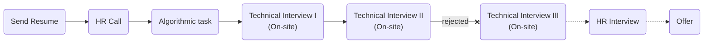

# [BitPin](https://bitpin.ir/)

### Status
#### 📜📞📝🔧🔧❌

## Software Engineer - Backend

### Interview Process


### Apply Way
Site & Jobinja

### Interview Date

- **Sent Resume**<br />1404.02.03

- **HR Call**<br />1404.01.18

- **Task** <br />1404.02.07

- **Technical Interview I (On-site)**<br />1404.06.24

- **Technical Interview II (On-site)**<br />1404.07.19

- **Rejection Email**<br />1404.07.22

### Interview Duration

- **Technical Interview I**<br />1 hour & 30 minutes

- **Technical Interview II**<br />1 hour & 30 minutes

### Interview Platform
In-person

### Task

<p dir="rtl">
به طور کلی فرآیند مصاحبه‌شون الگوریتمی سگیه به علاوه سیستم دیزاین. سوال‌ها رو هم باید کامل بزنید تا قبول شید ذات الگوریتم همینه.
مرحله اول زنگ می‌زنن یه لینک quera می‌فرستن که سه تا سواله و باید اونا رو حل کنید تا برسید مرحله بعدی. من دادم gpt و آپلود کردم درست بودن. ممکنه جواب‌ها بهینه نباشن اما کار می‌کنن.
</p>


- [First question](./a.pdf)
    <details>
    <summary style="font-size:14px"><b><em>Answer</em></b></summary>
    <div style="border:2px dashed #4a5568; padding:12px; border-radius:6px; margin-top:8px;  background-color: rgba(74,85,104,0.15);">

    ```python
    in_put = str(input())
    res = in_put.split()
    print(len(res[len(res) - 1]))
    ```
    </div>
    </details>
    <br/ >
- [Second question](./b.pdf)
    <details>
    <summary style="font-size:14px"><b><em>Answer</em></b></summary>
    <div style="border:2px dashed #4a5568; padding:12px; border-radius:6px; margin-top:8px;  background-color: rgba(74,85,104,0.15);">

    ```python
    def check_2sum(nums: list, k: int) -> tuple | int:
        map_ = {}
        for i in range(len(nums)):
            map_[nums[i]] = i

        for i in range(len(nums)):
            target = k - nums[i]
            if target in map_ and map_[target] != i:
                return i + 1, map_[target] + 1

        return -1


    n, target = map(int, input().split())
    nums = list(map(int, input().split()))
    res = check_2sum(nums, target)

    if res == -1:
        print(res)
    else:
        print(*res)
    ```
    </div>
    </details>
    <br/ >
- [Third question](./c.pdf)
    <details>
    <summary style="font-size:14px"><b><em>Answer</em></b></summary>
    <div style="border:2px dashed #4a5568; padding:12px; border-radius:6px; margin-top:8px;  background-color: rgba(74,85,104,0.15);">

    ```python
    def longest_palindromic_subsequence(s: str) -> int:
    n = len(s)
    dp = [[0] * n for _ in range(n)]

    for i in range(n):
        dp[i][i] = 1

    for length in range(2, n + 1):
        for i in range(n - length + 1):
            j = i + length - 1
            if s[i] == s[j]:
                if length == 2:
                    dp[i][j] = 2
                else:
                    dp[i][j] = dp[i + 1][j - 1] + 2
            else:
                dp[i][j] = max(dp[i + 1][j], dp[i][j - 1])

    return dp[0][n - 1]

    print(longest_palindromic_subsequence(input()))  # Output: 3 # Output: 5
    ```
    </div>
    </details>

### Technical Interview I (Live Coding)

- Tell me about yourself

- Write some test cases for this code:

    ```python
    def func(x: int):
        if x <= 0: 
            x += 2

        if x == 2:
            x = 100

        return x
    ```

    <details>
    <summary style="font-size:14px"><b><em>Answer</em></b></summary>
    <div style="border:2px dashed #4a5568; padding:12px; border-radius:6px; margin-top:8px;  background-color: rgba(74,85,104,0.15);">

    | Input | Explanation                              | Expected Output |
    | :---- | :--------------------------------------- | :-------------- |
    | `-3`  | `-3 + 2 = -1`                            | `-1`            |
    | `-2`  | `-2 + 2 = 0`                             | `0`             |
    | `-1`  | `-1 + 2 = 1`                             | `1`             |
    | `0`   | `0 + 2 = 2 → x == 2 → 100`               | `100`           |
    | `1`   | no change                                | `1`             |
    | `2`   | `x == 2 → 100`                           | `100`           |
    | `3`   | no change                                | `3`             |
    </div>
    </details>
    <br />

- [Valid parentheses](https://leetcode.com/problems/valid-parentheses/description/)

    <p dir="rtl">
    در ابتدا این سوال با وجود صرفا پرانتز مطرح شد و مصاحبه‌کننده بهم گفت رو تخته راه‌حلی که دارم رو بنویسم و اومدم کدش رو بزنم، گفت خب حالا جوری پیاده کن که بقیه کاراکترها (براکت و کروشه) هم هستن.
    این سوال رو بلد بودم و زدم و اوکی بود.
    </p>

    <details>
    <summary style="font-size:14px"><b><em>Answer</em></b></summary>
    <div style="border:2px dashed #4a5568; padding:12px; border-radius:6px; margin-top:8px;  background-color: rgba(74,85,104,0.15);">

    ```python
    def check_braces(args: str)-> bool:
        dic = {'(':')', '[':']', '{':'}'}
        stack = []
        for s in args:
            if s in dic:
                stack.append(s)
            elif stack == [] or dic[stack.pop()] != s:
                return False
        return stack == []
    ```
    </div>
    </details>

    <p dir="rtl">
    سپس ازم خواسته شد حالتی که فقط پرانتز داریم رو بهینه‌تر کنم و بدون استفاده از حافظه حل کنم و من این‌طوری نوشتم:
    </p>

    <details>
    <summary style="font-size:14px"><b><em>Answer</em></b></summary>
    <div style="border:2px dashed #4a5568; padding:12px; border-radius:6px; margin-top:8px;  background-color: rgba(74,85,104,0.15);">

    ```python
    def check_braces2(args: str)-> bool:
        counter = 0
        for s in args:
            if s == '(':
                counter += 1
            else:
                if counter == 0:
                    return False
                counter -= 1
        return counter == 0
    ```
    </div>
    </details>
    <br />

    <p dir="rtl">
    سپس ازم خواسته شد ورودی رو از stdin بگیرم و پس از زدن Enter جواب نشون داده بشه و اجازه سرچ برای این قسمت رو هم داشتم و در نهایت شد همچین چیزی:
    </p>

    <details>
    <summary style="font-size:14px"><b><em>Answer</em></b></summary>
    <div style="border:2px dashed #4a5568; padding:12px; border-radius:6px; margin-top:8px;  background-color: rgba(74,85,104,0.15);">

    ```python
    from sys import stdin

    def check_braces(args: str)-> bool:
            dic = {'(':')', '[':']', '{':'}'}
            stack = []
            for s in args:
                if s in dic:
                    stack.append(s)
                elif stack == [] or dic[stack.pop()] != s:
                    return False
            return stack == []


    def check_braces2(args: str)-> bool:
        counter = 0
        for s in args:
            if s == '(':
                counter += 1
            else:
                if counter == 0:
                    return False
                counter -=1
        return counter == 0


    def process():
        for line in stdin:
            print(check_braces(line.strip()))

    def process2():
        for line in stdin:
            print(check_braces2(line.strip()))

    # process()
    process2()
    ```
    </div>
    </details>


<p dir="rtl">
در آخر ازم پرسیده شد دوست داری فرآیند مصاحبه رو سریع‌تر طی کنیم؟ آیا عجله داری  که سریع‌تر طی بشه؟ منم گفتم بله خوشحال می‌شم.
</p>

### Technical Interview II (Live Coding)

- Tell me about yourself.

- [Candy](https://leetcode.com/problems/candy/description/)

    <p dir="rtl">
    مصاحبه‌کننده آدم بسیار باتجربه و مودب و خوش‌برخوردی بود. و مثل مصاحبه‌کننده مرحله اول گفت راه‌حلم رو توضیح بدم رو تخته بعد پیاده کنم. من سوال رو قبلا ندیده بودم و شک داشتم به جوابم و خیلی طول  کشید تا حل کنم و هی به باگ می‌خوردم. حس می‌کنم سر همین، خوب نبودم.
    تفاوتی که سوال با ورژن لیتکدی داشت، این بود که خروجی باید در یک لیست به تعداد لیست ورودی، تعداد candyهای هر کس رو نشون می‌داد.
    </p>

    <details>
    <summary style="font-size:14px"><b><em>My Answer</em></b></summary>
    <div style="border:2px dashed #4a5568; padding:12px; border-radius:6px; margin-top:8px;  background-color: rgba(74,85,104,0.15);">

    ```python
    def student_gift(nums: list):
        ans = [1] * len(nums)
        for i in range(len(nums)):
            for i in range(1, len(nums)):
                if nums[i] > nums[i - 1]:
                    if ans[i] > ans[i -1]:
                        continue
                    else:
                        ans[i]+= 1
                elif nums[i] < nums[i-1]:
                    if ans[i] < ans[i -1]:
                        continue
                    else:
                        ans[i-1]+=1

            for i in range(len(nums) - 1, 0, -1):
                if nums[i] > nums[i - 1]:
                    if ans[i] > ans[i -1]:
                        continue
                    else:
                        ans[i]+= 1
                elif nums[i] < nums[i-1]:
                    if ans[i] < ans[i -1]:
                        continue
                    else:
                        ans[i-1]+=1

        return ans


    students = [18, 14, 10,20]
    students2 = [i for i in range(1, 15)]
    students2.reverse()
    print("test case 1: ", students)
    result = student_gift(students)
    print("answer: ", result)
    print("test case 2: ", students2)
    result = student_gift(students2)
    print("answer: ", result)
    ```

    <p dir="rtl">
    خودم با این کد حال نکردم. قشنگ انگار رو دراگ زده شده.
    </p>

    </div>
    </details>

    <br />
    <details>
    <summary style="font-size:14px"><b><em>Leetcode Answer</em></b></summary>
    <div style="border:2px dashed #4a5568; padding:12px; border-radius:6px; margin-top:8px;  background-color: rgba(74,85,104,0.15);">

    ```python
    def candy(ratings):
        n = len(ratings)
        cnt = 0
        candies = [1] * n
        for i in range(1, n):
            if ratings[i] > ratings[i - 1]:
                candies[i] = candies[i - 1] + 1
        for i in range(n - 1, 0, -1):
            if ratings[i - 1] > ratings[i]:
                candies[i - 1] = max(candies[i] + 1, candies[i - 1])
            cnt += candies[i - 1]
        return cnt + candies[n - 1]
    ```

    [link](https://leetcode.com/problems/candy/solutions/6802500/double-pass-greedy-with-images-example-walkthrough-c-python-java/)
    </div>
    </details>


## Score
<h4><mark style="background-color:#ff9800; color:#ffffff; padding:4px 8px; border-radius:4px">7.5/10</mark></h4>

<p dir="rtl">
سخت‌ترین مصاحبه و بهترین عملکردم (به نسبت سختی موجود) بود. در کل با این مصاحبه‌های سخت و فرسایشی حال نمی‌کنم چون که یه کشور در کنج خاورمیانه زیر سایه جنگ و تحریم و با حقوق در نهایت هزار دلاری رو چه به الگوریتم و این اداها آخر؟ حالا از این گذشته که خودم نسبتا توش خوب بودم و به نظرم می‌شد رفت مرحله‌ی بعدی و مقداری دردم آمد چون بسیار نزدیک بود، مورد دیگری که خیلی رو مخم بود، حضوری بودن مصاحبه‌ها بود. هر دفعه باید بلند می‌شدم می‌رفتم اون سر جهان (سعادت آباد). به جز این موارد در کل شرکت خوب و ادایی‌ایه و جای خوبیه برای کار کردن و پول درآوردن.
</p>

