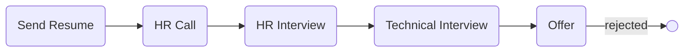

# [cpol](https://cpol.co)

### Status
#### 📜📞👱🏻‍♀️🔧❎
## Back-End developer (Django)
### Interview process

### Apply way
jobinja

### Interview date
- **Sent Resume**   1402.10.21

- **HR Call**  1402.10.26

- **HR Interview**   1402.10.27 11 AM

- **Technical Interview**   1402.11.02 11 AM

- **Offer**   1402.11.07

### Interview duration
- **HR Interview**  About 30 minutes

- **Technical Interview**   About 40 minutes

### HR Interview

تیپیکال سوالای hrای!

مصاحبه‌کننده وب‌کم رو روشن نکرد. من هم با گوشی اومده بودم تو میت و نمی‌دونستم اپ گوگل میت باگ داره و هی پرت می‌شدم بیرون. اولش فکر می‌کردم مشکل از اوناست بعدا فهمیدم مشکل منه. با چندین بار قطع و وصلی و مصیبت مصاحبه رو ادامه دادیم. درخشان!

<ul dir="rtl">
    <li>خودتو معرفی کن.</li>
    <li>چند سال سابقه کار داری؟</li>
    <li>وضعیت سربازیت چجوریه؟</li>
    <li>دانشگاهت چقد مونده؟</li>
    <li>چرا از شرکت قبلی اومدی بیرون؟</li>
    <li>قصد مهاجرت داری؟</li>
    <li>برنامت برای دو سال آینده چیه؟</li>
    <li>دو تا پروژه که با پایتون و جنگو زدی رو بفرست.</li>
    <li>یه لیست از لایبرری‌های پایتون و ابزارها آماده کرده بود و می‌پرسید که کار کردی و آشنایی؟ و تیک می‌زد.</li>
    <ul dir="rtl">
    	<li>redis</li>
    	<li>postgres</li>
     	<li>celery</li>
     	<li>numpy</li>
     	<li>pytest</li>
    </ul>
    <li>با چه زبانایی کار کردی؟</li>
    <li>خودتو تو چند کلمه توصیف کن.</li>
    <li>تا حالا شده تو کار خیلی احساس خوبی کنی؟ چی بوده؟</li>
    <li>بهترین و بدترین تجربت تو کار؟</li>
    <li>تا حالا شده که به نظرت یه چیزی درست باشه ولی باهات مخالفت کنن؟ چیکار کردی؟</li>
    <li>تست mbti دادی؟ گفتم آره ولی خیلی اعتقاد ندارم بهش.</li>
    <li>آخرین دریافتیت چقد بوده؟</li>
    <li>سوالی داری؟ فورا گفتم بله اگه می‌شه در مورد ساختار تیم‌ها و فضای شرکت توضیح بدین. که گفت درسته گفتم سوالی داری ولی الان یه مصاحبه دیگه شروع می‌شه (با خنده) و یه توضیح هول هولکی داد که نه من فهمیدم و نه خودش.</li>
</ul>

### Technical interview

دو نفر بودن که یکیشون hr بود و دیگری tech lead. باز هم تصویر hr دیده نمی‌شد و اون یکی دوست‌مون قابل رویت بود خداروشکر. خب من اینجا فهمیدم که اون باگ بیرون پرت شدن از منه و بعد چند بار قطع شدن گفتن که زنگ بزنیم پشت تلفن ادامه بدیم مصاحبه رو (تقریبا آخرای مصاحبه بود) که تصمیم درستی بود.

اکنون، در اینجا که هستم، یکی از عجیب‌ترین مصاحبه‌ها رو دارم تجربه می‌کنم. لیترالی ابوالعجایب! اولش با معرفی کن خودتو شروع شد و هیچ سوال فنی‌ای پرسیده نشد! یعنی طرف مقابل هی می‌پرسید تست نوشتی؟ اونجایی که کار می‌کردی چقد تست نوشتی؟ رو چی کار می‌کردی؟ تاکید شدید رو تست نوشتن داشتن. همچنین می‌پرسید چقد کد پروداکشن زدی؟ تو چه اسکیلی کار کردی؟ اینجا اسکیل میلیونیه ها. همش منتظر بودم از جنگو یا پایتون سوالاتی بپرسه اما دریغ از یک سوال. قبلش هم گفته بودن یه فایل به عنوان نمونه که با جنگو زدی بفرست. منم تسکی که برای مصاحبه دیجی‌کالا که با fastapi زده بودم رو فرستادم براشون. طرف می‌گفت اوکیه ولی چیزی با جنگو نداری؟ تاکید شدید رو فریموورک داشتن. من واقعا بدم میاد تاکید رو ابزار. ابزارها قابل یاد گرفتنن و مدام در حال عوض شدن. تو باید توانایی حل مسئله و میزان یادگیری رو بسنجی. بعد گفت اوکیه حالا اولش اگرم زیاد جنگو نزدی کمکت می‌کنیم راه بیوفتی ما یکیو می‌خوایم که تجربه بالایی در جنگو داشته باشه. به طور خلاصه بخوام بگم، حس جایی که درست حسابی باشه رو نمی‌گرفتم. حس انسجام و مرتب و منظم و منطقی و جای پیشرفت و رشد رو نمی‌گرفتم. به قول جوونای امروزی وایب بدی می‌داد خیلی ردفلگ بود.

### Offer

بعد از چند روز،  hr با شماره خودش (پیش شماره 933 داشت) زنگ زد و گفت ما اوکی‌ایم همکاری کنیم و رقم پیشنهادی رو گفت. دیدم خیلی کمه. پرسیدم ناهار و میان وعده چطوره؟ دورکاری؟ گفت ناهار با خودتونه و کار هم کلا حضوریه. گفتم تا یک هفته دیگه بهتون اطلاع می‌دم. گفت نمی‌شه زودتر؟ خیلی دیره. گفتم اوکی تا سه چهار روز دیگه می‌گم بهتون. مقداری اندیشیدم و چرتکه انداختم هر طور حساب کردم دیدم نمی‌صرفه. پول خورد و خوراک و جا رو بذاری کنار هیچی نمی‌مونه. بعد همون چند روزی که مهلت گرفته بودم به hr اسمس دادم (نمی‌دونم ملّت مشکل‌شون با ایمیل چیه) و گفتم به این دلایل نمی‌تونم همکاری کنم. جواب داد رقم درخواستیتون چقده؟ و در جواب رنج مورد نظرمو گفتم که بعدش گوستم کرد. می‌تونست یه پیام بده که ما توانایشو نداریم خیلی ممنون از شما یا همچین چیزی. نمی‌دونم این رفتارای کودکانه‌ی گوست‌گونه کی‌‌ می‌خواد درست بشه تو شرکتا.

### Score
**5/10**
 

این تجربه رو دوست نداشتم گرچه منجر به آفر شد. از نظر میزان سختی و چالش، من چیزی حس نکردم. خیلی راحت و بدون زحمت بود کل فرآیند که خود این، قضیه رو عجیب می‌کنه. باگ زیاد داشت که خودتون می‌تونید قضاوت کنید.

