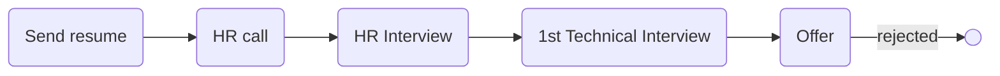

# [cpol](https://cpol.co)

### Interview process

### Status
#### 📜📞👱🏻‍♀️🔧❎
## Back-End developer (Django)

### Apply way
jobinja

### Interview duration
- **HR Interview**  About 30 minutes

- **Technical Interview**   About 40 minutes

### HR Interview

تیپیکال سوالای hrای

not turned on webcam
<ul dir="rtl">
    <li>خودتو معرفی کن.</li>
    <li>چند سال سابقه کاری داری؟</li>
    <li>دانشگاهت چقد مونده؟</li>
    <li>وضعیت سربازیت چجوریه؟</li>
    <li>چرا از شرکت قبلی اومدی بیرون؟</li>
    <li>قصد مهاجرت داری؟</li>
    <li>دو تا پروژه که با پایتون و جنگو زدی رو بفرست.</li>
    <li>یه لیست از لایبرری‌های پایتون و ابزارها رو آماده کرده بود و می‌پرسید که کار کردی و آشنایی و تیک می‌زد.</li>
    <li>سه تا ویژگی بارزت چیه؟</li>
    <li>تا حالا شده تو کار خیلی احساس خوبی کنی؟ چی بوده؟</li>
    <li>تست mbti دادی؟ گفتم آره ولی خیلی اعتقاد ندارم بهش.</li>
    <li>حقوق پیشنهایت؟</li>
</ul>

### Technical interview

یکی دیگر از عجایب مصاحبه رو تجربه کردم. هیچ سوال فنی‌ای پرسیده نشد. یعنی طرف مقابل هی می‌پرسید تست نوشتی؟ اونجایی که کار می‌کردی چقد تست نوشتی؟ رو چی کار می‌کردی؟ تاکید شدید رو تست نوشتن داشتن. همچنین می‌پرسید چقد کد پروداکشن زدی؟ تو چه اسکیلی کار کردی؟ اینجا اسکیل میلیونیه ها. همش منتظر بودم از جنگو یا پایتون سوالاتی بپرسه اما دریغ از یک سوال. قبلش هم گفته بودن یه فایل بع عنوان نمونه که با جنگو زدی بفرست. منم تسکی که برای مصاحبه دیجی‌کالا که با fastapi زده بودم رو فرستادم براشون. طرف می‌گفت اوکیه ولی چیزی با جنگو نداری؟ تاکید شدید رو فریموورک داشتن. من واقعا بدم میاد تاکید رو ابزار. ابزارها قابل یاد گرفتنن و مدام در حال عوض شدن. تو باید توانایی حل مسئله و میزان یادگیری رو بسنجی. بعد گفت اوکیه حالا اولش اگرم زیاد جنگو نزدی کمکت می‌کنیم راه بیوفتی ما یکیو می‌خوایم که تجربه بالایی در جنگو داشته باشه. به طور خلاصه بخوام بگم، حس جایی که درست حسابی باشه رو نمی‌گرفتم. حس انسجام و مرتب و منظم و منطقی و جای پیشرفت و رشد رو نمی‌گرفتم. به قول جوونای امروزی وایب بدی می‌داد خیلی ردفلگ بود.

TODO offer story

### Score
**5/10**
 

دوست نداشتم این تجربه رو گرچه منجر به آفر شد. از نظر میزان سختی و چالش، من چیزی حس نکردم. خیلی راحت و بدون زحمت بود کل فرآیند که خود این، قضیه رو عجیب می‌کنه.

