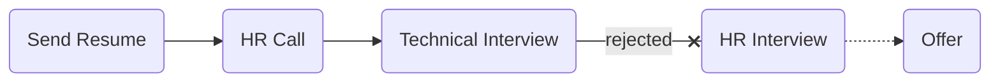

# [Dade Afzar Arman (daa)](http://daa.computer)

### Status
#### 📜📞🔧❎
## Backend Developer (C)
### Interview process

### Apply Way
Linkedin (Hiring)

### Interview Date
- **Sent Resume**  1401.09.19

- **HR Call (Skype voice chat)** 1401.09.20

- **Technical Interview**  1401.09.23 AT 4 PM

- **Rejection Letter**  1401.10.07

### Interview Duration

- **HR Call** 30 minutes!

- **Technical Interview**  30 minutes

### Interview Platform
Skype

### HR Call

وقتی با من تماس گرفتن، همه چیزایی که لازم بود رو پرسیدن و همه شرایط شرکت رو توضیح دادن. همه چی خوبه به بچه‌ها می‌رسیم ناهار، حقوق به موقع، بیمه، ریموت، امریه، پروژه سربازی، دورهمی، اتاق بازی، پاداش در هر ماه و فیچرهای شرکت. ۵۰ میلیون سفته هم باید می‌دادم. بعد از گفتن چنین چیزی عملا شرکت برای من مرد ولی گفتم حالا ببینم به آفر می‌رسه یا نه و یه سری سوال‌های معمول hrای که همه می‌پرسن در مورد دانشگاه و تکنولوژی و سربازی و این‌ها مشخص بود از رو کاغذ داره می‌خونه و تیک می‌زنه. گفت روند مصاحبه بسته به سطحت، ممکنه متغیر باشه. یا یه مصاحبه فنیه که اوکی می‌شی یا علاوه بر اون، یه تسک انجام می‌دی یا بعد اینا یه ماه آزمایشی کار می‌کنی. که اون یه ماه، حقوق و همه مزایا رو داره. یه مصاحبه هم با مدیرعامله. نظم و انظباط خیلی مهمه برامون، نگاه بالا به پایین نداریم و صحبت‌هایی با چاشنی شوآف. از این سخنرانیا که تهش باید بگی: «تموم شد؟ خیلی تاثیرگذار بود».

<ul dir="rtl">
    <li>چند سالتونه؟</li>
    <li>دانشجو هستین؟</li>
    <li>کجا سکونت دارید؟</li>
    <li>وضعیت سربازی‌تون به چه صورته؟</li>
    <li>قصد مهاجرت دارید؟</li>
    <li>با کار حضوری و فول‌تایم اوکی هستین؟</li>
    <li>برنامه‌تون برای ۵ سال آینده چیه؟</li>
    <li>تجربه‌ کاری‌تون چقدره؟</li>
    <li>انتظارتون از شرکت خوب چیه؟</li>
    <li>با شرکت‌های دیگه هم در حال مذاکره‌ای؟</li>
    <li>چه زبان‌هایی کار کردین؟</li>
    <li>با C کار کردین؟ یا دوست دارین که یاد بگیرین؟</li>
    <li>به امنیت علاقه دارین؟</li>
    <li>زبانت چطوره؟</li>
    <li>از کی می‌تونی کار کنی؟</li>
</ul>

### Technical Interview

مصاحبه با یه نفر بود و مصاحبه‌کننده وب‌کم رو روشن نکرد و چیزی هم درباره‌ش نگفت. بعدش فهمیدم برای مسائل امنیتی و ایناس!

- Tell me about yourself.

- At what level do you see yourself? I'm junior.

- What do you mean about "junior"? Explain more.

- Are you self-learn person?

- What technologies are you familiar with?

- What are your favorite technologies, and do you want to work with them?

- Are you familiar with django?

- What is difference between Authentication and Authorization?

- Suppose we have an application that we sell it to customer. Now we want change the database of that without changing anything on that application because it's not backward compatible how can we do that?

- Are you familiar with Database? ORM or SQL?

- What is restful?

- What does 'stateless' mean in the context of REST?

- What is your opinion about test?

- Are you familiar with linux?

- What is your OS?

- Are you familiar with redis?

- Are you familiar with mongoDB?

- Do you like working with C?

- Do you like security stuffs? Not security in software, that's about job.

<ul dir="rtl">
    <li>
    یه سوال می‌پرسم صادقانه جواب بدین، این سوال خیلی برای ما مهمه در فرآیند همکار شدن‌مون. شما در پاسخ به این سوال که امنیت رو دوست دارین، جواب‌تون مثبت بود اینجا منظور امنیت نرم‌افزار نبوده در واقع مقصود، کار بر روی پروژه‌های امنیتی، نظامی و محرمانه بوده. خیلی‌ها دوست دارن تو رزومه‌شون بگن چه کارهایی کردن یا با سواد فنی‌شون شوآف کنند. شما اگه بخواید تو این پوزیشن کار کنید نمی‌تونید این کارها رو بکنید یا بگید رو چه چیزی کار می‌کنید مثلا کسی که تو اسنپ کار می‌کنه، می‌گه رو پروژه مپ بودم و روی فلان الگوریتم‌ها کار می‌کردم و در لینکدین، همه می‌تونن ببینن در این‌جا چنین چیزی امکان‌پذیر نیست. یه سری‌ها با روحیات‌شون سازگاره و بعضی نه. شما شفاف پاسخ بدین که اوکی هستین با چنین فضایی یا خیر؟ من هم کاملا رک و شفاف گفتم خیر با روحیاتم سازگار نیست و اوکی نیستم.
    </li>
</ul>

از نظر سطح مصاحبه، برام ایزی بود، چیز چالش‌برانگیزی نداشت.

## Score
<h4><mark style="background-color:#ffd700">5/10</mark></h4>

مزایای شرکت خوب بود ولی خب با فضا و سفته اوکی نبودم. حتی هنوزم نمی‌دونم فعالیت‌شون چیه؟ اما قشنگ متوجه شدم که سوال آخر رو می‌گفتم بله، ریجکت نمی‌شد یعنی از نظر فنی؛ مشکلی نداشتم.

