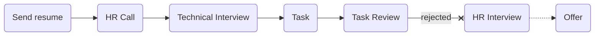

# [digikala(digicloud)](https://digicloud.ir/)

### Status
#### 📜📞🔧📝⚖️❌
## Python Engineer (Digicloud)
### Interview process

### Apply Way
jobinja & site

### Interview Date
- **Sent Resume**  1402.08.02

- **HR Call** 1402.08.09

- **Technical Interview**  1402.08.15 AT 4 PM

- **Task**  They sent 1402.08.23  I sent 1402.08.29

- **Task Review**  1402.09.08 AT 1 PM

- **Rejection Email**  1402.09.28

### Interview Duration
- **Technical Interview**  1 hour & About 30 minutes

- **Task**  1 week

- **Task Review**  About 1 hour

### Interview Platform
Google Meet

### Technical Interview

 خودت رو معرفی کن

- What is abc?

- What is decorator? and what feature python have that help decorator functionallity?

- What is django architecture? what is MVT?

- What is DI?

- Can we inherit from multiclasses in python? what algorithm behind it?

- What is list comprehension?

- What is SOLID?

- What is design pattern and which design pattern do u used?

- What is microservice? ...

- How can solve latency between our services in microservice architecture? how protect for loss data....

- Databases how in microservice arch?

- What is ACID?

- scenario

- What is RPC?

- How much do u work for DevOps stuffs?

- What is your git workflow?

- What is async and parallelism?

### Task

من خیلی وقت نداشتم برای انجام تسک حتی می‌خواستم کلا نزنم دیدم حسش نیس زیاده وقت بذارم ممکنه کلا ریجکت شه ولی گفتم دیجی‌کالاس یهو دیدی اوکی شد. خلاصه سعی کردم از اون‌جاهایی که بلدم شروع کنم و سه روزه زدم. همه چی داشت تسک‌شون. مهم‌ترین بخش، قسمت async و back-offاش بود که خوب نزدم ولی بقیه قسمتا رو خیلی تمیز زدم هدفم این بود کد مرتبی باشه و خب مثل این که همون دو قسمت براشون مهم بود.
 
<a href="./DigiCloud_Programming_Challenge.pdf">تسک</a>
 و
<a href="">جواب</a>
 من.

TODO my answer
### Task Review
TODO: about task

### Score
<h4><mark style="background-color:#54ca56">8.5/10</mark></h4>
