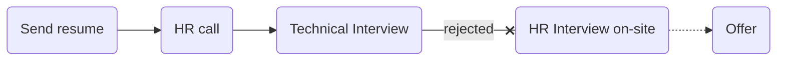

# [ozone social](https://ozone.ir)

### Status
#### 📜📞🔧👱🏻‍♀️❎
## Go developer
### Interview process

### Apply way
Linkedin

### Technical Interview

- Tell me about yourself.

- How does Golang handle memory management?

- Golang is OOP? have inheritance?

- What is Mutex?

- Suppose we have send a request to a service and some action failed. how can handle to break after process or other works?

- What is channel?

- What is waitgroup?

- Have you experience with RabbitMQ?

#### Live code

یه سوال الگوریتمی از codewars انتخاب کرده بودن که
<a href="https://www.codewars.com/kata/515decfd9dcfc23bb6000006/train/go">این</a>
بود. سرچ کردن هم آزاد بود.
 
من با استفاده از string و این‌ها سعی کردم مسئله رو حل کنم و روشی هم که تو ذهنم داشتم اوکی بود و مصاحبه‌‌کننده تایید کرد اما یه سری پیشنهاد داد که می‌تونی از لایبرری استفاده کنی برای ولیدیشن که خب من گفتم نمی‌دونستم می‌شه استفاده کرد چون مسائل الگوریتمی جوریه که می‌خوان بدونن چطور فکر می‌کنی. یه جاهایی برای تبدیل string به int سرچ کردم از اون‌جایی که سرچ آزاد بود. در کل ایزی بود.

### 2nd Interview
TODO

### Score
<h4><mark style="background-color:#54ca56">7/10</mark></h4>

قبلش به من نگفتن که لایوکد هم هست و من خیلی شرایط درستی براش نداشتم هر چند که کار دراومد ولی بهتر بود می‌گفتن.

TODO: I rejected in first one
