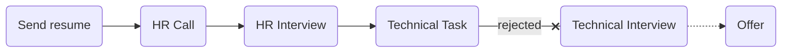

# [graph](https://graph-inc.ir)

### Status
#### 📜📞👱🏻‍♀️📝❌
## C++ developer
### Interview process

### Apply way
Linkedin

### Interview date
- **Sent Resume**   1400.07.08

- **HR Call**  1400.07.10

- **HR Interview**   1400.07.12 AT 3 PM

- **Task**   1400.07.14

### Interview duration
- **HR Interview**  30 minutes

### Interview Platform
Google Meet

### HR Interview

<ul dir="rtl">
    <li>خودت رو معرفی کن.</li>
    <li>ترم چندی؟ دانشگاهت چقد مونده؟</li>
    <li>اهل کجایی؟</li>
    <li>قصد مهاجرت اگه نداری بگو.</li>
    <li>پنج سال آینده خودتو کجا می‌بینی؟</li>
    <li>حقوق مدنظرت؟</li>
</ul>

### Task

یک
<a href="./graph-task.pdf">تسک</a>
فرستادن که ددلاینش یک هفته بود.
 
تسکش رو خوب نزدم و یه چیزی ماسمال کردم فرستادم که زده باشم. ایمیل دادن گفتن فلان جاشو درست کن بفرست چند روزم اضافه وقت دادن که دیگه نفرستادم اون تایم خیلی خوب بلد نبودم تسکه رو و بیخیالش شدم.

### Score
<h4><mark style="background-color:#54ca56">6.5/10</mark></h4>

به نظرم تسکی که فرستادن اندکی سخت بود. یعنی؛ برای مصاحبه یه چالش کوچولو باید باشه. با تسک مشکل دارم کلا. حتی live code رو به تسک ترجیح می‌دم، تموم می‌شه می‌ره و سریع‌ترم هست برخلاف عده‌ی کثیری که ازش می‌ترسن.

