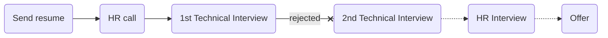

# [System group](https://www.systemgroup.net)


### Status
#### 📜📞🔧❌
## Golang Developer
### Interview process


### Apply way
jobinja

### Interview date
- **Sent Resume** <br /> 1402.03.00

- **HR Call**<br />1402.03.24

- **Technical Interview** <br>1402.03.24 AT 9 AM

- **Rejection Letter** <br />1402.03.27


### Interview duration
1 hour and 30 minutes

### Interview Platform
Skyroom

### Technical Interview

<p dir="rtl">
مصاحبه با دو نفر بود که هر دو فنی بودند. اولش لایوکد بود که از قبل نمی‌دونستم لایوکد داره بعد لابه‌لاش و بعدش سوال پرسیده می‌شد. خیلی سوالات در هم و برهم بود و دلیلشم این بود که هر چی که می‌گفتم از توش سوال درمیاوردن. مثلا از stringها تو go می‌رفتیم تو خود utf-8 یا از مفهوم stack می‌رفتیم به اون شاخه که تو گو چجوریه تو هیپ چجوریه بقیه زبانا چجورین و این شکلی. مینداختن گوشه رینگ و هر چیزی که تونستن، پرسیدن.
</p>

- Tell us about yourself.

- What is your contributions?

- What is your salary expectation?

- Your knowledge about database is the level of a database administrator?

- If our query is slow, how would you optimize it? What is your solution for this problem?

- Do you have an interest in frontend development?!

<p dir="rtl">
از این سوال مشخصه می‌خوان مثل برده از نیرو کار بکشن.<br>فرانت بزن بک بزن دواپسم بزن و از یک نیرو به اندازه چندتا نیرو کار بکشن.
</p>

- What is a slice, and what is the difference between a slice and an array?

- What is memory complexity when go tries to put our slice to another (big one)? <br />
Answer: use tahlil sarshekan
This [link](https://go.dev/blog/slices-intro) is all about slice.

- What is the difference between strings in Go and C?

- What is rune and size?

- What is UTf-8 and difference with ASCII? What is 8 mean? What is UTF-16?

- What is methods in go?

- What is data structure behind map?

- What is collision and how hash map handle it?

- What is OOP concepts that go don't have it?

- How do we use the encapsulation concept in Go?

- What is garbage collector?

- Waht is stack and differences between heap?

- Do you have experience with asynchronous or parallelism concepts?

- What is the difference between concurrency & parallelism?

- How can send data between processes?

- Explain call by reference & call by value.

- What is a race condition, and how can it be handled?

- Suppose we used other service that has error how can handle it?

- When should we use panic?

- It is reliable recovering a panic?

- Why try catch is bad idea and what is go approach for this?

- We have service out of here that panics somewhere and we don't want panic here because here is more important imagine something like rocket system how can handle this?

- Do you know busy waiting?

- What is defer?

- What is your feedback?

### Live code

<p dir="rtl">
محیطی که باید کد می‌زدم rustpad.io بود که انتخاب خوبی بود و ران کردن کد هم نبود همون psudo code استایل باید مسئله رو حل می‌کردم. فکر می‌کنم نمی‌شد سرچ کرد. البته مصاحبه‌کننده هم نمی‌فهمید اگه سرچ می‌کردم (به شرط سریع سرچ کردن).
</p>

#### Problem 1
Find the most repeated item in this array `[1,4,7,4,3,8,4]`. return `item` and `repeated time`.

<p><span style="color:#2f8916"><b>My answer</b></span>:</p>

```go
func getMostRepeatedNum(nums []int) (int, int) {
	numMap := make(map[int]int, len(nums))
	maxCount, maxNum := 0, 0
	for _, i := range nums {
    		numMap[i]++
    		if numMap[i] > maxCount {
        		maxCount = numMap[i]
        		maxNum = i
    		}
	}
	return maxNum, maxCount
}
```
You can run it [here](https://go.dev/play/p/PY7Rz8O15Ih).<br />
What is complexity of your code (time & memory)?

#### Problem 2
This code runs or fails? & Why?
What is zero value of struct?

```go
type a struct {
	B a
}
```

<p><span style="color:#2f8916"><b>Answer</b></span>:</p>

According [here](https://www.reddit.com/r/golang/comments/ag0j54/how_to_handle_recursive_types/);
If it's a value, then the zero value would be another Category, and you would have initialized, zero-value Categories all the way down until you overflow the stack. With a pointer, the zero value will just be nil. <br />
It can handle with pointer:
```go
type a struct {
	B *a
}
```
This [link](https://dave.cheney.net/2014/03/25/the-empty-struct) is good.
And [this](https://yourbasic.org/golang/default-zero-value/).

#### Problem 3
We have a linked list. Write a function to create string with this linked list. First char is `A`.
I can't remember the question is this or not. But sth like that.
```go
type MyString struct {
	Char rune
	Next *MyString
}

func CreateString(s MyString) string {
	// write sulotion
}

//otherPackage
myString := MyString{
	char = 'A',
}

```

<p><span style="color:#2f8916"><b>My answer (It's not complete)</b></span>:</p>

```go
func CreateString(s MyString) string {
	result := string(s.char)
	for s.next != nil {
    		result += s.char
    		s = s.next
	}
	return result
}

```

#### Problem 4
Write a function to check if slice is nil, return error otherwise, change first value then return that.

<p><span style="color:#2f8916"><b>My answer</b></span>:</p>

```go
func changeArray(a []int) ([]int, error) {
	if a == nil {
		return nil, errors.New("Error: Array is empty")
	}
	a[0] = 5
	return a, nil
}
```
You can run it [here](https://go.dev/play/p/4D31coxb8Wh).<br />

#### Problem 5

Suppose we have these tables.

```
student
id   name
-----------
1	amir
2	reza
3	mostafa

courses
id  title
---------
1   math
2   art
3   data structure

studentCourse
id   studentRef	     courseRef		grade
----------------------------------------------
1 	1          	2       	12
1 	2          	1       	18
1 	1          	3       	8
```
1 - Write a query shows students, course and grade like this:

```
amir art 12
reza math 18
mostafa dataStructure 8
```

2 - Write a query shows each student average grade.

## Score
<h4><mark style="background-color:#ffd700">5/10</mark></h4>

<p dir="rtl">
مصاحبه طولانی و طاقت‌فرسایی بود. سوالایی که پرسیدن به نظرم too much بود. واقعا این مقدار دیپ شدن لازم نیست برای جونیور تازه اونم برای شرکت خشک و سازمانی‌ای مثل همکاران سیستم! یکی از دوستانم بعد از چند ماه برای همین پوزیشن، رفته بود مصاحبه و دقیقا همین سوالا رو پرسیده بودن و نظر اونم با توجه به این که تجربه بیشتری از من داشت، این بود که زیاده‌روی‌ست. حقوقی که بهشون پیشنهاد دادم، پشماشون ریخت. گفتن منظورت خالصه انقد یا با بیمه و اینا؟ گفتم حقوق رو خالص می‌گن. این مال اون دوره‌ایه که مصاحبه می‌رفتم که فقط رقمو ببرم بالا واکنش‌ها رو ببینم، حال می‌ده بکنید از این کارها. در کل خیلی با شرکتای b2b و b2g حال نمی‌کنم. جاست فور فان بود نتیجه‌ش اصلا برام مهم نبود.
</p>
