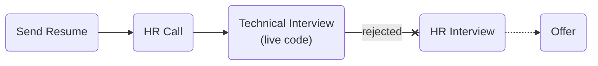

# [hamkaran system](https://www.systemgroup.net/)

### Status
#### 📜📞🔧❌

## Go Developer

### Interview Process


### Apply Way
Jobinja

### Interview Date
- **Sent Resume**<br />2025/07/21

- **HR Call**<br />2025/07/28

- **Technical Interview**<br />2025/08/02

- **Rejection Email**<br />2025/08/04

### Interview Duration
- **Technical Interview**<br />1 hour & 30 minutes

### Interview Platform
Google Meet

### Technical Interview
- Tell us about yourself.
#### Live code
<p dir="rtl">
رشته ای از پرانتز باز و پرانتز بسته را در نظر بگیرید. در این رشته‌ها هر پرانتز باز با یک پرانتز بسته جفت می باشد. مانند:

</p>

```
(())
()()
(())()
```
<p dir="rtl">
ارزیابی هر رشته‌ای از پرانتز باز و بسته را با قواعد زیر تعریف می کنیم:
</p>
<p dir="rtl">
۱. اگر رشته فقط و فقط شامل () باشد آنگاه مقدار ارزیابی آن معادل ۱ خواهد بود.

</p>
<p dir="rtl">
۲. فرض کنید که A  , ‌B  خود رشته ایی از پرانتز باز و بسته باشد آنگاه مقدار ارزیابی رشته ایی از اتصال آنها در کنار هم معادل مجموع ارزیابی هر دوی آنها خواهد بود. به عنوان مثال:
</p>

```
A = ()    =>    Eval(A) = 1
B = ()    =>    Eval(B) = 1

AB = ()()   =>    Eval(AB) = Eval(A)+Eval(B) = 1+ 1 = 2
```

<p dir="rtl">
۳. فرض کنید A رشته ای از پرانتز باز و پرانتز بسته باشد آنگاه مقدار رشته‌ی (A) برابر است با 2 به توان مقدار ارزیابی A. به عنوان مثال:
</p>

```
A = ()()()    =>   Eval(A) = 3
B = (A)      =>    Eval(B) = 2 ^ Eval(A) = 2 ^ 3 = 8
```

<p dir="rtl">
سوال: تابعی بنویسید که به عنوان ورودی رشته ایی از پرانتز باز و پرانتز بسته دریافت می کند و به عنوان خروجی مقدار ارزیابی آن را بر می گرداند.
مثال:
</p>


```
()  => 1
()() => 2
(()) => 2
(()()) => 4
()(())() =>4
```

<p dir="rtl">
این سوال رو نتونستم حل کنم.
</p>


<details>
<summary style="font-size:14px"><b><em>
Answer (GPT)
(Also in <a href="https://go.dev/play/p/Km2_nHMvixo">playground</a>)</em></b></summary>
<div style="border:2px dashed #4a5568; padding:12px; border-radius:6px; margin-top:8px;  background-color: rgba(74,85,104,0.15);">


```go
package main

import (
	"fmt"
	"log"
	"math"
)

// Eval computes the value of a balanced parentheses string based on rules:
// 1. "()" evaluates to 1
// 2. Concatenation AB evaluates to Eval(A) + Eval(B)
// 3. Wrapping (A) evaluates to 2^Eval(A)
func Eval(s string) int {
	// stack of ints; use -1 as marker for '('
	stack := []int{}

	for _, ch := range s {
		switch ch {
		case '(':
			// push marker
			stack = append(stack, -1)

		case ')':
			// check top of stack
			top := stack[len(stack)-1]
			if top == -1 {
				// it's "()": pop marker and push 1
				stack = stack[:len(stack)-1]
				stack = append(stack, 1)
			} else {
				// sum all values until marker
				sum := 0
				for len(stack) > 0 && stack[len(stack)-1] != -1 {
					sum += stack[len(stack)-1]
					stack = stack[:len(stack)-1]
				}
				// pop the marker
				if len(stack) == 0 {
					log.Fatal("invalid parentheses string")
				}
				stack = stack[:len(stack)-1]

				// compute 2^sum and push
				val := int(math.Pow(2, float64(sum)))
				stack = append(stack, val)
			}
		}
	}

	// final result is sum of stack
	result := 0
	for _, v := range stack {
		result += v
	}
	return result
}

func main() {
	tests := []string{"()", "()()", "(())", "(()())", "()(())()"}
	for _, t := range tests {
		fmt.Printf("%s => %d\n", t, Eval(t))
	}
}
```

</div>
</details>


### Score
<h4><mark style="background-color:#DC3545">4/10</mark></h4>

<p dir="rtl">
مثل دفعه قبل (که چند سال پیش بود) حال نکردم با داستان. اسنپ اینطوری نیست سوالاش (که اگه شرکت خوب در نظر بگیریمش) ادای تک دارن، اما در واقعیت سنتی، کارمندی، دست چندم و مناطق محروم استایل. طبق معمول صحبتی در مورد تجربیات نبود و در طول مصاحبه سوال می‌کردم یا راهنمایی می‌خواستم، کابل رو می‌گرفتن. نه من خوب بودم نه اونا.
</p>
