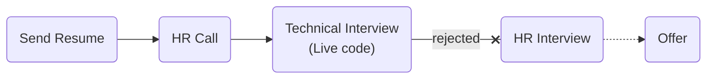

# [Malltina](https://malltina.com/)

### Status
#### 📜📞🔧❌

## Senior Software Engineer (python)

### Interview Process


### Apply Way
Jobinja

### Interview Date

- **Sent Resume**<br />1404.05.12

- **HR Call**<br />1404.05.21

- **Technical Interview**<br />1404.05.22

- **Response Email**<br /> not get any rejection Email

### Interview Duration
- **Technical Interview**<br />1 hour & 30 minutes

### Interview Platform
Google Meet

### Technical Interview
- Tell us about yourself.

#### Live code

Write a function to calculate `pow(x, n)`.
<details>
<summary style="font-size:14px"><b><em>My answer</em></b></summary>
<div>

```python
import sys

def pow(x: float, n: int) -> float:
    res = 1
    if n == 0:
        return res
    while n > 0:
        if n % 2 == 1:
            res *= x
        x *=x
        n >>= 1
    return res

x = 10000
n = 20000
ans = pow(x, n)
print(ans)
```
</div>
</details>

### Score
<h4><mark style="background-color:#ff9800; color:#ffffff; padding:4px 8px; border-radius:4px">6/10</mark></h4>
<p dir="rtl">
اوکی بود خیلی نظر خاصی ندارم. مقداری عجیب بود چنین شرکت نه چندان شناخته‌شده‌ای لایوکد داشته باشه. روند مصاحبه هم معرفی بود و حل مسئله. ایمیل ریجکتی هم ندادند.
</p>
