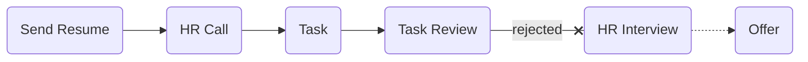

# [mori](https://mori.style/)

### Status
#### 📜📞🔧⚖️❌

## AI Software Engineer - Full Stack

### Interview Process

### Apply Way
LinkedIn & Quera

### Interview Date

- **Sent Resume** 1403.08.09

- **HR Call** 1403.08.23

- **Task** 1403.08.23

- **Task Review** 1403.09.04

- **Rejection Email** 1403.09.16

### Interview Duration

- **Task Deadline** 3 days

- **Task Review** 1 hour

### Interview Platform
Google Meet

### Task

در ابتدا تسکی فرستادند که سنگین بود و عملا گفته بودند سایت ما رو بزن (: که می‌تونید از
<a href="./mori_task.pdf">این‌جا</a>
یا
<a href="https://docs.google.com/document/d/1NWrI43bm-wViNqOkGhbTsj4thcCHLSNiDfQQdDIiyYU/edit?tab=t.0">این‌جا</a>
ببینید. و همین‌طور 
<a href="https://github.com/mo1ein/dorimoripori">جواب</a>
من رو. با توجه به سنگینی تسک (چون فرانت هم داشت و یه سری تکنولوژی‌ها که کار نکرده بودم) ازشون خواستم یه مقدار وقت بیشتر بدن و پرسیدن چقد زمان می‌خوای و دو روز رو قبول کردن.

### Task Review

مصاحبه با دو نفر بود.

- Tell us about yourself.

- Tell me about the main challenges you faced in your recent roles.

- What’s the serializable isolation level in a database?

- How many people were on your team?

- What were the average/peak DAU for the systems you worked on?

- What are you interested in, and what direction do you want your career to go (like personal roadmap)?

- Why are you interested in Go? What made you pick it up?

- Describe the task you worked on, and then we'll tell you a feature to add to it.

- What technologies were you already familiar with on this project, and which ones did you learn?

- Feature for previous task (**live code**): We want to sell our code as a service to companies using tokens.  For example: 4 companies can use our search service for their own products.

- Any questions?

## Score
<h4><mark style="background-color:#4caf50; color:#ffffff; padding:4px 8px; border-radius:4px">8.5/10</mark></h4>

پروداکت باحالی دارن و تونستن به بازارهای بیرون از ایران هم راه پیدا کنن dori پروداکت اون‌وری‌شونه، از نکات جالب این که پوزیشن فول‌ریموت بود. تیم کوچیک و خیلی خفن و مشتی‌ای هم دارن، خیلی دوست داشتم باهاشون کارکنم. در نهایت نتیجه رو این‌جوری اعلام کردن «از بین حدودا 140 نفری که برای ما اپلای کردند شما بین 6 نفر اصلی گزینه ما بودید که یعنی ما به توانایی شما معتقد بودیم. از جهت فیدبک دادن در راستای وقتی که گذاشتید از دلایل اصلی این تصمیم این بود که طبق بنچمارک های ما که شامل موارد مختلفی بود شما در تسک و آنلاین کدینگ نفر 5ام شدید.» این‌جاست که باید اموجی بغض گذاشت.

