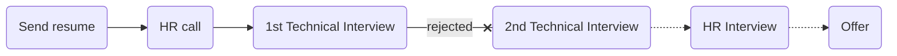

# [namava](https://www.namava.ir/home)

### Status
#### 📜📞📝❌

## Intern Front-end developer
### Interview process

### Apply Way

Telegram

### Interview Date

- **Sent Resume**   1403.04.11

- **HR Call**  1403.04.17

- **Technical Interview**   1403.04.18 AT 12 PM

- **HR Interview**    1403.04.22 AT 12 PM

- **Rejection Email**   1403.05.03

### Interview Duration

- **Technical Interview**  45 minute

- **HR Interview**  1 hour

### Interview Platform
Namava Platform

### Technical Interview

مصاحبه با دو نفر بود که یکیشون فنی بود یکی هم HR بودن. در مجموع رفتارشون خیلی دوستانه بود و چون پوزیشن برای کارآموزی بود خیلی سوالات ساده بودن

- Tell me about yourself.

- What is css selector?

- what is virtul DOM in Reactjs ?

- What is the CSS box model in CSS?

- How do CSS Flexbox and CSS Grid differ, and when would you use each?
- What is the difference between var, let, and const in JavaScript?
- What is the purpose of the useEffect hook in React, and how does it work?

به تمام سوالاتش جواب دادم ولی دلیل ریجکت شدن رو اخرش نفهمیدم.

<ul dir="rtl">
    <li> از خودت بگو چرا تغییر رشته دادی و چرا فرانت انتخاب کردی</li>
    <li>اهل کجایی؟</li>
    <li>اولین تجربه کاریته درسته؟</li>
    <li> چرا تو رشته خودت ادامه ندادی؟</li>
    <li>تو تیم کار کردی؟</li>

   
   </li>
    <li>با جاهای دیگه هم تو پروسه مصاحبه هستی؟</li>
   <li> ازدواج کردی؟</li>
  <li>  برای یادگیری چیز های جدید مثل تست نویسی مشکل نداری؟</li>
    
   
   
    
</ul>

### Score

<mark style="background-color:#54ca56; font-size:16 px;"><b>6/10</b></mark>

در کل از مصاحبه کننده راضی نبودم و خیلی میخواست در مورد زندگی شخصی من بدونه که واقعا رد فلگ بود برام. تنها خوبیش این بود که کارش فول ریموت بود ولی توی ایمیل بهم نگفتن دلیل ریجکتی چی هستش.

