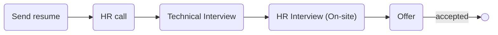

# [narvan](https://narvanventures.com/)
#  [invex](https://invex.ir)

### Status
#### 📜📞🔧👱🏻‍♀️✅

## Python developer
### Interview process

### Apply Way

jobinja & Quera

### Interview Date

- **Sent Resume**   1401.10.

- **HR Call**  1401.10.19

- **Technical Interview**   1401.10.20 AT 12 PM

- **HR Interview (On-site)**   1401.11.04 AT 1 PM

- **Offer**   1401.11.05

### Interview Duration

- **Technical Interview**  1 hour

- **HR Interview**  1 hour

### Interview Platform
Google Meet

### Technical Interview

- Tell me about yourself.
- What is systemD?
- How can we know capacity of disk or directory? what command?
- What is your OS?
- How much you experienced with django?
- What is middleware in django?
- What is your typing speed?
- Do you like golang or python and why?
- Do you familiar with docker?
- How network models in docker?
- What is http1 and http2 differences?
- Python is call by reference or call by value?
- What is call by reference and value?
- What is gRPC?
- What are differences between python async and go concurrency?
- What databases do you work?
- What is NoSql?
- mongoDB is NoSql?
- Can you write query?
- What is LEFT OUTER JOIN?
- What is GIL?
- What is python memory management?

### HR Interview (On-site)

دو نفر بودن که یکی hr manager بود و دیگری co-founder که خیلی آدم خوش برخورد و کول و مودبی بود.

<ul dir="rtl">
    <li>اولین تجربه کاریته درسته؟</li>
    <li>وضعیت سربازیت چجوریه؟</li>
    <li>دانشگاهت چقد مونده؟</li>
    <li>قصد مهاجرت داری؟</li>
    <li>برنامت برای دو سال آینده چیه؟</li>
    <li>ویژگی بارزت؟</li>
    <li>ویژگی منفیت؟</li>
    <li>تو تیم کار کردی؟</li>
    <li>اگه یکیو ناراحت کنی تو شرکت چطوری حلش می‌کنی؟</li>
    <li>حقوق مد نظرت؟</li>
    <li>ما انتخاب چندمتیم؟</li>
    <li>ناهار خوردی؟ ناهار اگه می‌خوری هست. بله.</li>
</ul>

### Offer

### Score

<mark style="background-color:#54ca56; font-size:16 px;"><b>7.5/10</b></mark>

