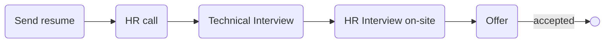

# [narvan](https://narvanventures.com/)

### Status
#### 📜📞🔧👱🏻‍♀️✅

## Python developer
### Interview process

### Technical Interview

- Tell me about yourself.
- What is systemD?
- How can we know capacity of disk or directory? what command?
- What is your OS?
- How much you experienced with django?
- What is middleware in django?
- What is your typing speed?
- Do you like golang or python and why?
- Do you familiar with docker?
- How network models in docker?
- What is http1 and http2 differences?
- Python is call by reference or call by value?
- What is call by reference and value?
- What is gRPC?
- What are differences between python async and go concurrency?
- What databases do you work?
- What is NoSql?
- mongoDB is NoSql?
- Can you write query?
- What is LEFT OUTER JOIN?
- What is GIL?
- What is python memory management?

TODO: add more questions

### HR Interview (On-site)
TODO

### Score

<mark style="background-color:#54ca56; font-size:16 px;"><b>7.5/10</b></mark>

