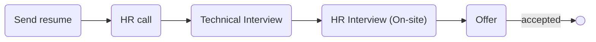

# [narvan](https://narvanventures.com/)
#  [invex](https://invex.ir)

### Status
#### 📜📞🔧👱🏻‍♀️✅

## Python developer
### Interview process

### Apply Way

jobinja & Quera

### Interview Date

- **Sent Resume**   1401.10.

- **HR Call**  1401.10.19

- **Technical Interview**   1401.10.20 AT 12 PM

- **HR Interview (On-site)**   1401.11.04 AT 1 PM

- **Offer**   1401.11.05

### Interview Duration

- **Technical Interview**  1 hour

- **HR Interview**  1 hour

### Interview Platform
Google Meet

### Technical Interview

مصاحبه با یک نفر بود که CTO شرکت بود. لابه‌لای سوالات فنی، سوالات شخصی پرسیده می‌شد و خیلی سریع هم در حال یادداشت بود این سرعت استرس می‌داد. بعدا که رفتم شرکت دیدم مثلا تو یه روز با ده نفر مصاحبه می‌کنه و دلیلش اونه.

- Tell me about yourself.

- What is systemD?

- How can we know capacity of disk or directory? what command?

- What is your OS?

- How much experience do you have with Django?

- What is middleware in django?

- What is your typing speed?

- Do you like golang or python and why?

- Do you familiar with docker?

- How network models in docker?

- What is http1 and http2 differences?

- Python is call by reference or call by value?

- What is call by reference and value?

- What is gRPC?

- What are differences between python async and go concurrency?

- What databases have you worked with?

- What is NoSql?

- mongoDB is a NoSql?

- Can you write query?

- What is LEFT OUTER JOIN?

- What is GIL?

- What is python memory management?

جواب چند سوالو گفتم نمی‌دونم و بعدش حس کردم خب به خاطر اونا ریجکته که نشد. (:

### HR Interview (On-site)

دو نفر بودن که یکی HR manager بود و دیگری co-founder که خیلی آدم خوش برخورد و کول و مودبی بود.
گپ و گفت دوستانه بود و لابه‌لاش به شکل روانشناسانه‌ای سوالا رو می‌پرسیدن. یعنی یه بحثی شکل می‌گرفت و من توضیح می‌دادم و به موضوع a اشاره می‌کردم و مصاحبه‌کننده از موضوع a سوالایی می‌کرد یا واکنشی نشون می‌داد و به نتیجه b که جواب سوال اصلیش بود، می‌رسید؛ حرفه‌ای و بلد بودن.

<ul dir="rtl">
    <li>چی در مورد نارون می‌دونی؟</li>
    <li>اهل کجایی؟</li>
    <li>تهران کجا می‌خوای بمونی؟ خونه می‌گیری؟ خوابگاه می‌مونی؟</li>
    <li>اولین تجربه کاریته درسته؟</li>
    <li>وضعیت سربازیت چجوریه؟</li>
    <li>دانشگاهت چقد مونده؟</li>
    <li>قصد مهاجرت داری؟</li>
    <li>برنامت برای دو سال آینده چیه؟</li>
    <li>اگه روشت درست باشه تو تیم و موافقت نشه باهاش چی کار می‌کنی؟</li>
    <li>تو تیم کار کردی؟</li>
    <li>دوستات تو رو به چی می‌شناسن؟</li>
    <li>اخلاق بدات چیاس؟</li>
    <li>برای درست کردنشون چه تلاشی کردی؟</li>
    <li>خودت دوست داری تو چیا بهتر باشی؟</li>
    <li>اگه یکیو ناراحت کنی تو شرکت چطوری حلش می‌کنی؟</li>
    <li>چه آدمایی سختن؟</li>
    <li>قبل این که بیای تصورت راجع به اینجا چطوری بود؟  یعنی گفتی میام شرکت چطوریه؟ بچه‌ها چطورین؟ فضا چه شکلیه؟</li>
    <li>با جاهای دیگه هم تو پروسه مصاحبه هستی؟</li>
    <li>ما انتخاب چندمتیم؟</li>
    <li>چی باعث می‌شه که ما بشیم انتخاب اولت؟</li>
    <li>اگه اوکی باشیم کی می‌تونی بیای؟</li>
    <li>آدم متمرکزی هستی؟</li>
    <li>تو open office می‌تونی کار کنی؟</li>
    <li>من اگه مدیر مستقیمت باشم چیکار کنم که پشیمون بشی از اومدن به نارون؟</li>
    <li>حس می‌کنم آدمی هستی که self learning بالایی داری درسته؟</li>
    <li>چی شد که دانشگات انقد طولانی شد؟</li>
    <li>حقوق مد نظرت؟</li>
    <li>ناهار خوردی؟ ناهار اگه می‌خوری هست. بله.</li>
</ul>

### Offer

روز بعد مصاحبه، آفر رو فرستادن. من از وقتی که گفتن مرحله دوم حضوری بیا، سیگنال مثبتو گرفتم فهمیدم اوکیه قضیه.

### Score

<mark style="background-color:#54ca56; font-size:16 px;"><b>8/10</b></mark>

شرکت خوبیه فرهنگ خوبی داره برای شروع خوبه.

