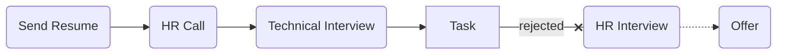

# [Netbox](https://netbox.info/)

### Status
#### 📜📞🔧❌📝

## Back-End Developer

### Interview Process

### Apply Way
LinkedIn

### Interview Date

- **Sent Resume** 1404/06/12

- **HR Call** 1404/06/23

- **Technical Interview** 1404/06/26

- **Rejection Email** 1404/07/13

### Interview Duration
- **Technical Interview** 1 hour & 30 minutes

### Interview Platform
Google Meet

### Technical Interview
- Tell us about yourself.

### Task

پس از مصاحبه فنی تسکی فرستادند که می‌تونید از
<a href="./VOD Scraper — Interview Task.pdf">این‌جا</a>
ببینید. و همین‌طور 
<a href="https://github.com/mo1ein/vod_scraper">جواب</a>
من رو.

## Score
<h4><mark style="background-color:#4caf50; color:#ffffff; padding:4px 8px; border-radius:4px">8/10</mark></h4>
