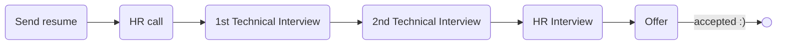

# [ozone social](https://ozone.ir)

### Status
#### 📜📞🔧🔧👱🏻‍♀️✅
## Go developer
### Interview Process

### Apply Way
Linkedin

### Interview Date
- **Sent Resume**  1402.08.13

- **HR Call** 1402.08.16

- **1st Technical Interview**  1402.08.20 AT 11:30 AM

- **2nd Technical Interview**  1402.12.09 AT 6 PM

- **HR Interview**  1402.12.19 12 PM

- **Offer**  1402.12.26

### Interview Duration

- **1st Technical Interview**  1 hour

- **2nd Technical Interview**  30 minutes

- **HR Interview**  30 minuts

### 1st Technical Interview

یک بار تایم مصاحبه رو عوض کردم که خیلی حرفه‌ای برخورد کردن. مصاحبه خوبی بود و خودم از خودم راضی بودم و وقتی لایوکدو زدم دیگه گفتم تمومه کار.

- Tell me about yourself.

- How much experience do you have with Go?

- Is Golang an OOP language?

- Go has inheritance concept?

- What is Mutex?

- Suppose we have sent a request to a service and an action failed. How can we handle other processes to know that the action has failed and handle them accordingly?

- What is channel?

- What is waitgroup?

- Do you have you experience with RabbitMQ?

- Any questions?

#### Live code

یه سوال الگوریتمی از codewars انتخاب کرده بودن که
<a href="https://www.codewars.com/kata/515decfd9dcfc23bb6000006/train/go">این</a>
بود. سرچ کردن هم آزاد بود.
 
من با استفاده از string و این‌ها سعی کردم مسئله رو حل کنم و روشی هم که تو ذهنم داشتم اوکی بود و مصاحبه‌‌کننده تایید کرد اما یه سری پیشنهاد داد که می‌تونی از لایبرری استفاده کنی برای ولیدیشن که خب من گفتم نمی‌دونستم می‌شه استفاده کرد چون مسائل الگوریتمی جوریه که می‌خوان بدونن چطور فکر می‌کنی. یه جاهایی برای تبدیل string به int سرچ کردم. در کل روال بود برام.

قبلش به من نگفتن که لایوکد هم هست و من خیلی شرایط درستی براش نداشتم هر چند که کار دراومد ولی بهتر بود می‌گفتن.

### 2nd Technical Interview

این مصاحبه با VP of engineering بود. خیلی مصاحبه خوبی بود و سوالات مهندس نرم‌افزاری پرسیده شد که در مورد نوع نگرش به مسائل بود. مصاحبه‌کننده بسیار خوش‌برخورد، مودب و کول بود. یک بار جلسه رو کنسل کرده بود و بابت اون عذرخواهی کرد. در مورد رزومه‌م گفت من رزومه رو کلی دیدم فقط یه جا کار کرده بودی که این دلیل بر کم بودن توانایی‌هات نیست... حرفه‌ای بود.

- I know your background briefly. Tell me more about it.

- How long were you there (last company)?

- What is your uni major?

- We have 2 mindsets in software engineering. One is "tools, languages and stack is not important, you should solve problems regardless of tools." and the other one is "tools is important and everyone have to solve problems with tools that know them". Which mindset do you prefer?

- If a task is difficult or not familliar with it (language, tool and etc.), what whould be your approach? Would you face it or not?

- Which part of the codebase do you write unit test for it?

- How do you found a bug in system. How you write test?

- If you want to write test, how you start? Starting with easy part, important part or hard part?

- Do you know redis? What did you do with it?

- Do you living alone? Sorry this is personal question: Are you single or married?

- What is your plan for new year?

- Talking about salary.

- Any questions?

### HR Interview

کاملا جلسه اوکی و روالی بود، سوالا رو بارها شنیده بودم، جوابای خوبی داشتم و اساسی تونستم تفت بدم. قطع و وصلی زیاد داشتیم هم از سمت من هم از سمت مصاحبه‌کننده نت افتضاح بود ولی خب گذروندیم.

<ul dir="rtl">
    <li>خودتو معرفی کن.</li>
    <li>از کجا با ما آشنا شدی؟</li>
    <li>به عنوان software engineer چی کارا کردی تو شرکت قبلی؟</li>
    <li>چندتا ویژگی مثبتی که تو ctoات دیدی بگو.</li>
    <li>چرا از شرکت قبلی اومدی بیرون؟</li>
    <li>پس تو تیم کار کردی؟</li>
    <li>شده که به نظرت یه روش درستی پیش گرفتی ولی بقیه مخالفت کنن؟ چجوری قانعشون کردی؟</li>
    <li>شده با یکی به مشکل بخوری؟ چطوری حلش کردی؟</li>
    <li>برنامت برا سال جدید چیه؟</li>
    <li>چیا برات خیلی مهمه که اونا باعث می‌شه یه جا بمونی یا بری؟</li>
    <li>چقد طول می‌کشه که ببینی اونجایی که هستی برای توئه یا نه؟ چقد فرصت می‌دی؟</li>
    <li>تهران تنها زندگی می‌کردی؟ یا اشتراکی؟</li>
    <li>سوالی داری؟</li>
</ul>

### Score
<h4><mark style="background-color:#54ca56">8/10</mark></h4>

مصاحبه‌ها خوب بود به ویژه فنی‌ها که اندازه و درست بود. یک بار بعد مصاحبه اول گفتن حضوری برم برای مصاحبه که من تا حدودی فهمیدم اوکیه قضیه (طبق تجربه بعد یه مصاحبه می‌گن حضوری بیا یعنی ۸۰ درصد اوکیه) اما اون تایم شرایطم جوری بود که نمی‌تونستم حضوری فول‌تایم باشم و به همین دلیل بهشون اطلاع دادم که نمی‌تونم (برای همینه تایم مصاحبه‌ها انقد فاصله داره و جدای اون دو مورد کنسلی هم بود). بعد از حدود ۴ ماه،  دوباره تو لینکدین پیام دادم (میزان پاسخ‌گویی‌شون تو لینکدین ۱۰/۱۰ بود واقعا) که اگه اوکی هستین من شرایطم اوکیه و خب جلسه ست کردن و فوقع ما وقع. (: تا حدی من سیگنال سبز رو گرفته بودم، هم اون اول هم بعد بازگشت دوباره که خب باحال بود این روند.

