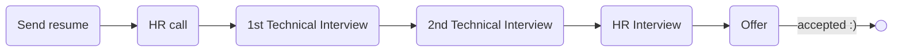

# [ozone social](https://ozone.ir)

### Status
#### 📜📞🔧🔧👱🏻‍♀️✅
## Go developer
### Interview process

### Apply Way
Linkedin

### Interview Date
- **Sent Resume**  1402.08.13

- **HR Call** 1402.08.16

- **1st Technical Interview**  1402.08.20 AT 11:30 AM

- **2nd Technical Interview**  1402.12.09 AT 6 PM

- **HR Interview**  1402.12.19 12 PM

- **Offer**  1402.12.26

### Interview Duration

- **1st Technical Interview**  1 hour

- **2nd Technical Interview**  30 minutes

- **HR Interview**  30 minuts

### 1st Technical Interview

- Tell me about yourself.

- How does Golang handle memory management?

- Golang is OOP? have inheritance?

- What is Mutex?

- Suppose we have send a request to a service and some action failed. how can handle to break after process or other works?

- What is channel?

- What is waitgroup?

- Have you experience with RabbitMQ?

#### Live code

یه سوال الگوریتمی از codewars انتخاب کرده بودن که
<a href="https://www.codewars.com/kata/515decfd9dcfc23bb6000006/train/go">این</a>
بود. سرچ کردن هم آزاد بود.
 
من با استفاده از string و این‌ها سعی کردم مسئله رو حل کنم و روشی هم که تو ذهنم داشتم اوکی بود و مصاحبه‌‌کننده تایید کرد اما یه سری پیشنهاد داد که می‌تونی از لایبرری استفاده کنی برای ولیدیشن که خب من گفتم نمی‌دونستم می‌شه استفاده کرد چون مسائل الگوریتمی جوریه که می‌خوان بدونن چطور فکر می‌کنی. یه جاهایی برای تبدیل string به int سرچ کردم از اون‌جایی که سرچ آزاد بود. در کل ایزی بود.

قبلش به من نگفتن که لایوکد هم هست و من خیلی شرایط درستی براش نداشتم هر چند که کار دراومد ولی بهتر بود می‌گفتن.

### 2nd Technical Interview

- I know a brief of your background. Tell me more about it.

- How long were you there (last company)?

- What is your uni major?

- We have 2 mindsets in software engineering. One is "tools, languages and stack is not important, you should solve problems regardless of tools." and the other one is "tools is important and everyone have to solve problems with tools that know them". Which mindset you prefer?

- If a task is hard or you r not familliar with it (language, tool and etc.), what is your approach? Are you face it with it? or not?

- Where is of codebase you write unit test for it?

- How you found a bug in system. How you write test?

- If you want to write test, how you start? Starting with easy part, important part or hard part?

- Do you know REDIS? What did you do with it?

- Are you single or married?

- What is your plan for new year?

- Talking about salary.

- Any questions?

### HR Interview

کاملا جلسه اوکی و روالی بود، سوالا رو بارها شنیده بودم، جوابای خوبی داشتم و اساسی می‌تونستم تفت بدم.

تودو قطع و وصلی
<ul dir="rtl">
    <li>خودتو معرفی کن.</li>
    <li>از کجا با ما آشنا شدی؟</li>
    <li>به عنوان software engineer چی کارا کردی تو شرکت قبلی؟</li>
    <li>چندتا ویژگی مثبتی که تو ctoات دیدی بگو.</li>
    <li>چرا از شرکت قبلی اومدی بیرون؟</li>
    <li>پس تو تیم کار کردی؟</li>
    <li>شده که به نظرت یه روش درستی پیش گرفتی ولی بقیه مخالفت کنن؟ چجوری قانعشون کردی؟</li>
    <li>شده با یکی به مشکل بخوری؟ چطوری حلش کردی؟</li>
    <li>برنامت برا سال جدید چیه؟</li>
    <li>چیا برات خیلی مهمه که اونا باعث می‌شه یه جا بمونی یا بری؟</li>
    <li>چقد طول می‌کشه که ببینی اونجایی که هستی برای توئه یا نه؟ چقد فرصت می‌دی؟</li>
    <li>تهران تنها زندگی می‌کردی؟ یا اشتراکی؟</li>
    <li>سوالی داری؟</li>
</ul>

### Score
<h4><mark style="background-color:#54ca56">8/10</mark></h4>

TODO: I rejected in first one
