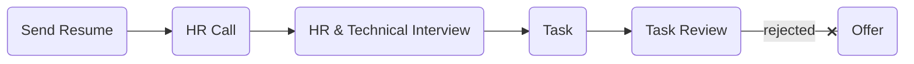

# [phanous](https://phanous.ir)

### Status
#### 📜📞🔧📝⚖️❌
## Software Engineer
### Interview process

### Apply way
Linkedin

### Interview date
- **Sent Resume**   1400.07.08

- **HR Call**  1400.08.04

TODO: they said we have two Interview and set two of them once

- **HR & Technical Interview**   1400.08.09 AT 11 AM

- **Task**   1400.08.12 & I sent 1400.08.16

- **Task Review & Live code**   1400.08.22 AT 11 AM

- **Rejection Email**   1400.09.14

### Interview duration
- **HR & Technical Interview**  1 hour

- **Task**  6 days

- **Task Review & Live code**  2 hours

### Interview Platform
gharar.ir

### HR & Technical Interview

مصاحبه با دو نفر بود که یکی HR بود و دیگری فنی. لابه‌لای سوالای hrای اون یکی دوستمون میومد سوالای فنی می‌پرسید. 

<ul dir="rtl">
<li>ما رو می‌شناسی؟ می‌دونی چیکار می‌کنیم؟</li>
<li>از خودت بگو.</li>
<li>پلنت برای چند سال آینده چیه؟</li>
<li>تو تیم کار کردی؟</li>
<li>شده تو تیم با یکی به مشکل بخوری؟ چطوری حلش کردی؟</li>
<li>چی باعث می‌شه از شرکت ما بری؟</li>
<li>چندتا از ویژگی‌های خوبت رو بگو. چیزایی که بهش افتخار می‌کنی.</li>
<li>از چی خیلی بدت میاد و آزارت می ده؟</li>

</ul>

### Technical Questions
- What is REST?

- When type google.com what's happening?

- What is Docker?

- Someone tries to login our system with brute force approach. What's your solution to deal with this problem?

- What is threads and parallel in cpp or python?

### Task

<a href="./Phanous Software Engineer task.pdf">تسک</a>
 ساده‌ای بود و ۴ روزه زدم. به خوبی نیازمندی‌های خواسته شده رو پوشش می‌داد.
<a href="">لینکش</a>.

### Task Review & Live code

در مورد تسک خیلی بحثی نبود چندتا نکته بود که برای بهتر شدنش بیان شد. یکی این که برای تبدیل عدد به فارسی و انگلیسی (همچین چیزی فکر کنم) چرا از لایبرری استفاده کردی؟ خودت می‌تونستی با string هندل کن ی. یکی دیگه هم استفاده از bare except ها بود. بعدش یه ریپو از گیتهاب معرفی کرد که یک فایل منیجر بود که با go نوشته شده بود. گفت اول اینو clone کن و بیارش بالا. برای استفاده ازش اولش یه پسوورد می‌خواست که من دهنم صاف شد از تو ریپو پیداش کنم استرس داشتم پس از پا زدن‌های بسیار و یکم راهنمایی مصاحبه‌کننده دیدم تو داک نوشتن. (: بعدش گفت خب موقع استفاده از این ممکنه یه سری فایل به اون دایرکتوری اضافه بشه یا تغییر کنه. یه اسکریپت بنویس که بالا باشه و هر فایلی که تغییر کرد بهمون بگه. سرچ هم آزاد بود. که خب من خیلی زور زدم و دقیقا نمی‌دونستم چیکار کنم یه چیزایی هم با پایتون نوشتم که نصفه نیمه کار می‌کرد و مفاهیم async رو هم بلد نبودم و خب کار درنیومد. از دو ساعت‌های فرسایشی بود. وسطا مصاحبه‌کننده محو می‌شد قطع امید کرده بود. من هم خیلی بلند بلند فکر نمی‌کردم.

## Score
<h4><mark style="background-color:#54ca56">8/10</mark></h4>

به طور کلی، تجربه خوبی بود و کاملا تسک‌محور. یه مقدار سوالای HRای زیادی داشت تو مرحله اول و به شکل روانشناسانه‌ای سوال‌پیچ شده بودم. مشخص بود هر دو تو کارشون حرفه‌ای‌ان. تو مصاحبه بعد از تسک، خیلی نتونستم خوب عمل کنم و خودم بعدش حس می‌کردم که کنسله. اما همه مراحل دقیق و مرتب توضیح داده شده بود، چه توضیحات تسک و چه ایمیل‌هایی که رد و بدل می‌شد. همه تمپلیت‌ داشت و همه حالت‌هایی که ممکن بود رخ بده رو، در نظر گرفته بودن که همه اینارو تو سایت‌شون هم می‌شد دید و انگلیسی بود. ایمیل فارسی طبق تجربه، برای من مثل code smells عه، بوی بی‌نظمی و ناهماهنگی می‌ده. پیام ریجکت‌ باحالیم فرستادن. نوشته بودن شما جوانید و توانایی‌های شما نسبت به سنتون خیلی خوبه اما ما یکی رو گرفتیم که از شما پیرتره و تجربه بیشتری داره.

