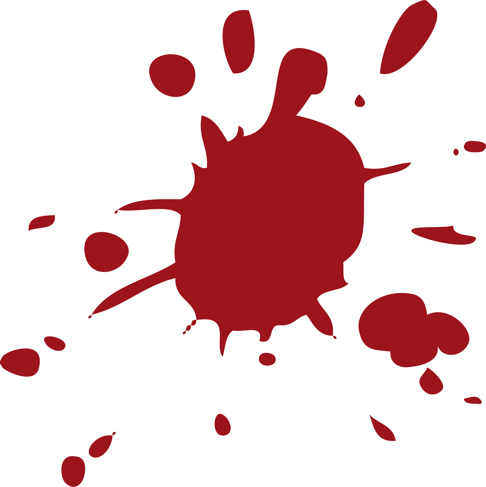

<h2 id="redflags" dir="rtl"><a class="header" href="#redflags">پرچم‌های خونی🚩</a></h2>

<ul dir="rtl">
    <li>احترام و شعور خط قرمزه و فقط یه بار می‌تونن ردش کنن. توهین به رزومه، چهره، جنسیت، قومیت، باورها و اعتقادات، نگاه بالا به پایین و... در هر زمینه‌ای.</li>
     
    <li>شرکتی که سفته می‌خواد از بیخ کنسله. یعنی از همون اول که شما می‌ری deal کنی، طرف مقابل با شمشیر نشسته. پس باید تو محیط جنگی کار کنی!</li>
     
    <li>شرکتی که از اولین مصاحبه‌ای که می‌خواد انجام بده، اصرار به حضوری بودن جلسه داره. آدما کار دارن، زندگی دارن، ممکنه یکی شهر دیگه‌ای باشه، یا محل زندگی‌ش با شرکت، فاصله زیادی داشته باشه و باید کلی هزینه و زمان بذاره بیاد مصاحبه‌ای که نه به داره و نه به باره.</li>
     
    <li>شرکتی که مدت طولانی برای یک پوزیشن در سایت‌های کاریابی آگهی داره، ندای یک جای تاکسیک رو می‌ده. یا انقد شرایطش بده که کسی حاضر نمی‌شه اونجا کار کنه یا هی آدما از اونجا میان بیرون و دوام نمیارن یا انقد بی‌عرضه‌ست که نمی‌تونه یه نیرو پیدا کنه.</li>
     
    <li>شرکتی که از چیزی جز ایمیل و لینکدین برای ارتباط استفاده می‌کنه. مثلا اسمس، واتسپ، تلگرام و... بوی حرفه‌ای نبودن می‌ده. درستش؛ زنگ، ایمیل و لینکدینه.</li>
     
    <li>داشتن بروکراسی و کاغذ‌بازی برای ساده‌ترین کارها به عنوان نمونه کوچک مثلا؛ کاغذ میارن از روش می‌خونن سوالا رو تیک می‌زنن. این یعنی؛ شرکتی‌ست بی‌آب و علف‌.</li>
     
    <li>شرکتی که ناهار یا بیمه نمی‌ده، کنسله. ناهار و بیمه و حقوق سر وقت و چیزهایی از این قبیل، جزو وظایف یک شرکته نه فیچر. تو آگهی‌ها اینا رو به عنوان فیچر بهتون غالب می‌کنن. مثل این می‌مونه من بیام عدم کتک‌کاری و وحشی‌بازی در محل کار رو یک فیچر بدونم. خب این بدوی‌ترین چیزه که باید رعایت بشه حالا یه سریا رعایت نمی‌کنن فیچر نیس یه چیزی مثل نسبت منفی و صفر مطلقه.</li>
     
    <li>روشن نکردن وب‌کم در مصاحبه بدون اطلاع دادن از چرایی ماجرا.  مصاحبه‌کننده حداقل باید یه رخی نشون بده، هر چند کوتاه.</li>
     
    <li>داشتن سیستم اضافه‌کاری و عدم شناور بودن و سیستم‌ تسک‌محور، یعنی؛ برده‌داری.</li>
     
    <li>عدم وجود نیروی منابع انسانی در شرکت.</li>
     
    <li>سابقه افرادی که در شرکتی کار می‌کنن، مهمه. از روی همون‌ها می‌شه فهمید حدودا چه تفکری دارند.  رنگ رخساره خبر میدهد از سر درون.</li>
</ul>
