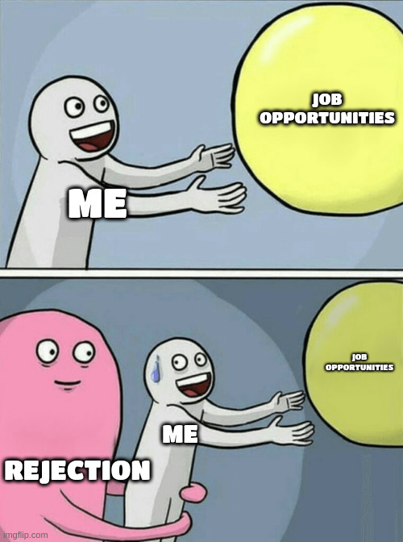

<h2 id="refer" dir="rtl"><a class="header" href="#refer"><mark style="background-color:#DC3545">ریجکت، ریجکت، ریجکت...</mark></a></h2>

آخ چقدر این کلمه آشناست! همه ما حداقل یه بار تجربه‌ش کردیم. اون دوره‌ای که آدم دنبال کاره، پر از استرس، فشار، کاهش نمایی اعتماد‌به‌نفس، استأسال، تنهایی و حسی حاوی خالی شدنه که نتیجه‌ی پرسیدن سوال تکراریِ «اه چرا نشد؟ چرا نمی‌شه؟»ئه که تو ذهن رخ می‌ده. هیچ! بله هیچ ربطی هم به دانش فنی نداره. اصلا اینجوری بگم که شما فرض کنید پرفکتید، باز هم ریجکت شدن، رخ می‌ده (<a href="https://rejected.us/">این‌جا</a> رو ببین). به هزاران دلیلی که دقیقا نمی‌فهمیم چرا و فقط با حدس و گمان و reverse engineering مصاحبه کشف می‌کنیم که چرا. پس چاقوی ریجکشن تیزه و گریزی ازش نیست. حتما زخمیت می‌کنه. این که چطوری زخمو ببندی و دوران نقاهت رو بگذرونی، هنره. چیزی که به نظر من خیلی مهمه، اینه که از اون حال و هوا بیای بیرون و حواست رو پرت کنی، گویی که اصلا اون اتفاق رخ نداده و با دوپامین دیگری، افت سطح دوپامین ناشی از ایمیل‌های ریجکتی رو پر کنی. تاثیرگذارترین عوامل، تفریح کردن و گذران وقت با دوستان و دل‌بندانه. صحبت کردن با دیگری (صرفا فقط صحبت کردن) موجب حس آرامش می‌شه. هر چی بیشتر با پارتنر یا دوستان (مشخصا اگه پارتنر دارید دوست سگ کی باشه؟ (:) وقت بگذرونید، آرام‌تر و منطقی‌تر این مسیر پرفراز و نشیب رو طی می‌کنید. اگر هم باز آروم نمی‌شید و مغزتون به فاک می‌ره، یا تنهایید و دوستی ندارید و سینگل بدبختم هستید، اشکالی ندارد، طبیعی‌ست. می‌تونم این قول رو بهتون بدم که نمی‌میرید! همچنین، درست می‌شه. بله می‌دونم اگه تو این دوره هستید، نفرت‌انگیزترین جمله همینه.

 ولی خب واقعیته و فراری ازش نیست. تو کامیونیتیِ آدمایی که دنبال کار هستن، هم باشید، چون درد مشترک دارید باهاشون و می‌تونید تبادل اطلاعات کنید، باز می‌تونه کمک کنه که فکر نکنید تنهایید و فقط شما هستید که ریجکت می‌شید. فیلم و سریال دیدن هم خوب است. باعث می‌شه حدودا یه دو ساعتی (اگه شبی یه فیلم یا یه قسمت سریال ببینید) به چیزی فکر نکنید. نوشتن از حس و حال در لحظه هم می‌تونه از پرخاش ذهن کم کنه و حتی بعدا خوندنش جالبه می‌فهمید که چقد تغییر کردید یا چجوری بوده حس‌تون. پس شد:

<ul dir="rtl">
	<li>وقت‌گذرانی با زید و دوستان (به کلمه زید گیر ندید خیلیم خوبه)</li>
	<li>تفریح و سرگرمی (فیلم و سریال)</li>
	<li>نوشتن</li>
</ul>

البته روحیات و مدل آدما فرق داره و نمی‌شه حکم کلی داد و هر کس باید مدل خودشو پیاده کنه که چجوری حالشو خوب کنه، اما اشتراک تجربه‌ هم چیز بدی نیست و همون‌طور که ما آدما خیلی باهم فرق داریم، خیلیم شبیهیم.

