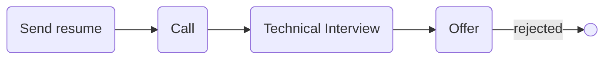

# [siz-tel](http://siz-tel.com/)

### Status
#### 📜📞🔧❎
## Golang Internship
### Interview process

### Apply way
Linkedin

### Interview duration
1 hour

### Technical Interview

- Tell me about yourself.

- What is python decorator?

- Why go?

- Do you written test in your company?

### Score

<h4><mark style="background-color:#54ca56">6/10</mark></h4>

برای این پوزیشن باید سه ماه مفتی کار می‌کردی که خب من به همین دلیل ریجکت کردم وگرنه اوکی بود.

