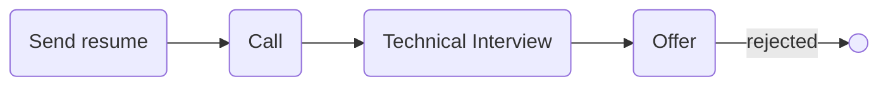

# [siz-tel](http://siz-tel.com/)

### Status
#### 📜📞🔧❎
## Junior Golang Developer
### Interview process

### Apply way
Linkedin

### Interview Date
- **Sent Resume**   1402.08.30

- **Technical Interview**   1402.09.04 AT 12 PM

- **Offer**   1402.09.06

### Interview Duration
1 hour

### Technical Interview

- Why go? Tell me about go and features.

- Tell me about go data types.

- Difference between array and slice?

- Difference between SQL and NoSQL databases? Which one is faster?

- When we are using message brokers?

- What use did you have of message brokers in your past company?

- What is redis data types?

- What is goroutine?

- What is channel?

- What is interface?

- What is anonymous function?

- If we want to know type of var in runtime, how can figure out?

- Difference between concurrency and parallelism?

#### Live code

صفحه رو که شِیر کردم مصاحبه‌کننده گفت: با vim و tmux می‌خوای کد بزنی جدی؟ گفتم آره صرفا چندتا فانکشن کوچولو می‌خوایم بنویسیم دیگه نیازی به IDE نیس. (:
یه چلنج ریز در مورد goroutineها بود. هدف نحوه کار باهاشون و مفهوم چنل و سینتکس کلی go بود. چلنجه این بود که دو تا goroutine داریم و می‌خوایم از یکی به اون یکی دیتا بفرستیم (با channel) و یه سری پیام نشون بدیم. که خب لابه‌لاش سوالای مفهومی که اگه goroutineای که تو main وجود داره تموم بشه چه اتفاقی برای بقیه میوفته یا چرا بدون استفاده از sleep بقیه goroutineها نشون داده نمی‌شدن و سوالاتی از این دست. من هم کانسپت کلی رو می‌دونستم (همیشه کانسپت مهمه جزئیات داکیومنت داره) که خب waitGroup چیه و اون وقفه برا اینه که اگه روتین اصلی تموم بشه بقیه هم kill می‌شن. یکم برای پیدا کردن کتابخونه‌هایی مثل rand و waitGroup سرچ کردم برای این که بدونم از کجا import می‌شن که سرچ هم آزاد بود. در کل اوکی بود با این که از قبل حس می‌کردم رو concurrency مسلط نیستم. کدی که زدم رو
<a href="./challenge.go">این‌جا</a>
می‌تونید ببینید.

### Score
<h4><mark style="background-color:#54ca56">8/10</mark></h4>

من یک بار برای internship با این شرکت مصاحبه کرده بودم که چون حقوق نداشت رد کردم. اصلا در مخیله‌ام نمی‌گنجه کار کنی و پول ندن! ربطی به سطح هم نداره چون عدد کم یه بحثه، نداشتن حقوق بحث دیگه. اصلا چیز قابل قبولی نیست. انی‌وی. بعدها دیدم که پست گذاشتن برای جونیور و دوباره به همون کسی که مصاحبه داشتم، تو لینکدین پیام دادم و گفتم مایل به همکاری هستم گفت اوکیه یه تایم ست کن مصاحبه کنیم که برای این کار از calendly استفاده می‌کردن. hrای هم نبود و همه کارا رو تک‌لید (یاseniorشون) انجام می‌داد. بعدش که اوکی شد و دو روز بعد از مصاحبه با شماره خودش زنگ زد و گفت اوکی‌ای علاقمندی و درسته تجربت زیاد نیس ولی کارو درمیاری. چه عددی مد نظرته؟ منم عددم رو (که خب می‌خواستم بالاتر از اونجایی که قبلا بودم باشه)‌ رو گفتم و ایشون گفتن که بالاس و خیلی فاصله داره با چیزی که مد نظر ماست و داستان همین‌جا به پایان می‌رسه. فکر کنم ناهار هم نداشتن. ناهار وظیفه شرکته. اما امریه داشتن و کاری که می‌کردن باحال بود.

