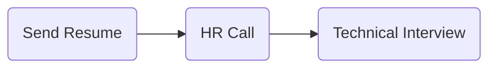

# [Snapp Shop](http://snappshop.ir/)

### Status
#### 📜📞🔧

## Front-End Developer

### Interview Process

### Apply Way
Jobinja

### Interview Date

- **Sent Resume** 2026/05/26

- **HR Call** 2026/06/17

- **Technical Interview** 2026/06/21

- **Response Email** Date not set

### Interview Duration
- **Technical Interview** 40 minutes

### Interview Platform
Google Meet

### Technical Interview
- Can you briefly introduce yourself?

- If your tech lead asked you to implement something in the project that isn't considered a best practice, and they said, "I know it's not ideal, but just do it for now because we're under time pressure," what would you do?

- If you were reviewing a teammate's pull request and noticed they had implemented something incorrectly, how would you handle it?

- Suppose the Product Manager assigns you a task and expects it to be completed by the end of the week, giving you only three days. After analyzing it, you realize it will take at least two weeks. What would you do? Would you accept the deadline? And if they said, "We'll assign more people to help you," would that solve the problem?

- What's the most serious bug you've ever deployed to production?

- How did you react after realizing you had deployed a bug to production? What was your internal thought process?

- If you had a disagreement with a teammate about a technical decision, how would you resolve it?

- Imagine you're designing a framework or development approach for a small team of three developers, with the goal of delivering features quickly while maintaining good quality. What would you choose, and why?

- Explanation of the next stage:

You'll receive a project along with its documentation.
Your task is to review the codebase, identify areas that need improvement, document your suggestions, and implement fixes for three of those improvements.

## Score
<h4><mark style="background-color:#ff9800; color:#ffffff; padding:4px 8px; border-radius:4px">6/10</mark></h4>

    ابتدای مصاحبه بهم گفته شد که هیچ کدوم از این سوال ها جواب درست یا غلط ندارن و صرفا طرز فکر شما و نوع حل مسئله‌تون رو می‌سنجیم. مصاحبه با تک لید بود و توی تماس بهم گفته شد که مصاحبه تکنیکال خواهد بود اما هیچ کدوم از سوالات واقعا تکنیکال به حساب نمیومدن و بیشتر مرتبط با کالچر سازمانی بود. در انتها هم در مورد مکان سازمان، تیم ها، تیمی که قراره بهش اضافه بشم و مرحله ی بعد که یه پروژه ارسال می شه تا هم نکاتی که باعث می شه بهبود پیدا کنه رو داکیومنت کنم هم سه موردش رو فیکس کنم و زیپ شده ارسال کنم. اما فایلی برای من ارسال نشد و ایمیل ریجکت هم دریافت نکردم! که معنیش همون ریجکته.

