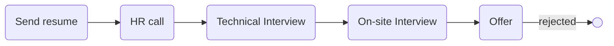

# [sternx](sternx.de)

### Status
#### 📜📞🔧👱🏻‍♀️❎
## Senior Golang developer

### Interview process

### Apply way
jobinja

### Interview duration
About 45 minutes (i think)

### Technical Interview

do nafar bodan ceo and cto

- Tell me about yourself.

- you have contributed...

- Go is don't have class and it's not OOP. Can you explain that?

- Are you familiar with design patterns?

- What is decorator in python?

- We have menu and there is subtasks and folding. How you can solve this? with graph. bfs dfs.

- What do u know about git?

- What is git rebase?

- What's your salary suggestion?

### 2nd Interview (On-site)
TODO

### Score
#### 7/10

TODO: I rejected in first one
