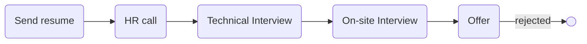

# [sternx](sternx.de)

### Status
#### 📜📞🔧👱🏻‍♀️❎
## Senior Golang developer

### Interview process

### Apply way
jobinja

### Interview Duration
- **1st Technical Interview**  About 45 minutes
- **2nd Technical Interview**  6 hours

### 1st Technical Interview

مصاحبه با دو نفر بود. مدیرعامل و CTO. اول مصاحبه CTO در مورد کامتریبیوت‌های گیتهابم سوال کرد و خیلی جذب شده بود به کانتریبیوتم رو یکی از پروژه‌های گوگل. چون با پروژه اوپن‌سورس کار داشتن، به نظرشون من مناسب بودم.

- Tell me about yourself.

- Are you student?

- Do you have any job experience or have you made any money from programming?

- You contributed multiple repositories in GitHub and one of them is for Google. Can you explain that?

- Go doesn't have classes and is not based on OOP principles. Can you explain that?

- Are you familiar with design patterns?

- What is decorator in python?

- We have this menu and there are task & subtasks. How you can traverse all items and access to each?

    <video width="320" height="240" autoplay loop muted>
        <source src="fold_question.mp4" type="video/mp4" />
    </video>

&nbsp;&nbsp;&nbsp;&nbsp;&nbsp;&nbsp;&nbsp;&nbsp;&nbsp;&nbsp;<b>My answer</b>: With graph. it's a tree and with BFS & DFS, we can traverse it.

- What do you know about git?

- What is git rebase?

- What's your salary suggestion?

### 2nd Interview (On-site)

بعد اولین مصاحبه زنگ زدن که یه جلسه حضوری باید برم. رقم و اینارو صحبت کردیم. مصاحبه نبود خیلی بیشتر توضیح در مورد پروژه و چیزی که روش کار می‌کردن بود. روی mdm solution کار می‌کردن (تکنولوژی جالبیه اگه دوست داشتید سرچ کنید) و از یه لایبرری اوپن‌سورس استفاده می‌کردن که با گو نوشته شده بود. منو برای این می‌خواستن که اونو توسعه بدم و داشتن اونو بهم توضیح می‌دادن. یه ساعتی بهم توضیح دادن که چیه اصلا این لایبرری! شرکت کوچیک و خوبی بود و ناهارم نداشتن انگار البته به من یه ساندویچ کالباس آماده دادن و هر کی ناهار خودشو رو میزش یا تو آشپزخونه می‌خورد. با تیم یکم آشنا شدم و رفتار CTO هم خیلی کول و صمیمی بود. با پروژه‌ها ور رفتم و خوندم و CTO شماره خودشو بهم داد گفت برو بخون یکم ببین می‌تونی توسعه بدی؟ هر چی سوال داشتی هم بپرس. بیشتر آشنایی با محیط و تیم بود. بعدش هم خورد به روزهای قطع اینترنت و کلا همه چی رفت رو هوا و خب من خیلی نمی‌تونستم روش وقت بذارم و نه من پیگیر شدم و نه اونا.

### Score
<h4><mark style="background-color:#54ca56">7/10</mark></h4>

مصاحبه اوکی‌ای بود. یکم به نظرم می‌شد سوالای فنی بیشتری پرسید ولی خب خیلی سخت نگرفتن و از اون طرف حقوق بالا یا ناهار نداشت و محل شرکت هم اون موقع پشت مصلا بود و جای جالبی نبود. نمره ۷ نمره خوبیه.

