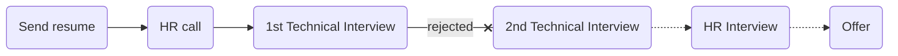

# [Toman](https://tomanpay.net/)

### Status
#### 📜📞🔧❌
## Senior Backend Developer (Python/Django)
### Interview process

### Apply way
Refer

### Interview Date

- **HR Call**  1403.03.27

- **Technical Interview**   1403.03.30

- **Rejection Email**   1400.04.02

### Interview Duration
- **Technical Interview**   1 Hour and 30 minutes

### Interview Platform
Microsoft Teams

### 1st Technical Interview

- Interviewer Told about himself and The culture in Toman.

- Tell me about yourself and your experience.

- Tell me about Django request life-cycle.

- In which order django middlewares work

- Is the order of middlewares are same when processing response compare to processing requests?

- Can you tell what is the usage of UWSGI/Gunicorn?

- Imagine a micro-services architecture. we want to follow up a request to have a track of them in the system. How do you suggest to track them. _A: My Answer was to add a unique code in the header of the request_

- How can we make sure that the codes you said, are unique? _A: My answer was using UUID_

- Ok, we made the requests unique. Where can we store them?

- How queues in a message broker works? Are they working simultaneously?

- How to know how many queues do we need? (I didn't know the answer!)

- What if Our RabbitMQ or Celery Fails? What is your solution not too lose any of the tracking data?

- Can You tell what are the migration files in django?

- Did you have any sepecific challenge with the django migrations?

- Have you ever changed the migration files manually for any specific reason?

- Do you have any other question?

### Score
<h4><mark style="background-color:#54ca56">9/10</mark></h4>

فرایند هماهنگی خوب بود. مصاحبه‌کننده خیلی حرفه‌ای و همینطور صمیمانه رفتار کرد و فرهنگ شرکتو توضیح داد و از نظر من خیلی مناسب بود رفتار و جو مصاحبه. میتینگ روی مایکروسافت تیمز بود که چون نسخهٔ لینوکسی نداره با وب وصل شدم و کمی به سختی لود شد. در مجموع جواب‌های منم بد نبودن و خودم راضیم. قطعاً ریجکت شدن هم پیش میاد به هر شکلی که بگذره چون عدهٔ زیادی مصاحبه می‌شن و شرکت‌های فیت‌ترینشونو انتخاب می‌کنن.

