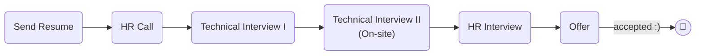

# [Visiwise](https://www.visiwise.co/)

### Status
#### 📜📞🔧🔧👱🏻‍♀️✅🎉

## Software Engineer

### Interview Process


### Apply Way
Email & LinkedIn & Jobinja & Jobvision

### Interview Date

- **Sent Resume**<br />1404.08.14

- **HR Call**<br />1404.09.05

- **Technical Interview I**<br />1404.09.06

- **Technical Interview II**<br />1404.09.16

- **HR Interview**<br />1404.09.24

- **Offer**<br />1404.10.01

### Interview Duration
- **Technical Interview I**<br />1 hours

- **Technical Interview II**<br />2 hours

- **HR Interview**<br />1 hours

### Interview Platform
Google Meet

### Technical Interview I

- Tell me about yourself.

- database question that i tell him transx outbox
    <details>
    <summary style="font-size:14px"><b><em>Answer</em></b></summary>
    <div style="border:2px dashed #4a5568; padding:12px; border-radius:6px; margin-top:8px;  background-color: rgba(74,85,104,0.15);">

    Answer not provided

    </div>
    </details>
- database question...
    <details>
    <summary style="font-size:14px"><b><em>Answer</em></b></summary>
    <div style="border:2px dashed #4a5568; padding:12px; border-radius:6px; margin-top:8px;  background-color: rgba(74,85,104,0.15);">

    Answer not provided

    </div>
    </details>

#### Live coding

- [Prefix Sum of Matrix](https://www.geeksforgeeks.org/dsa/prefix-sum-2d-array/?utm_source=chatgpt.com)
    <details>
    <summary style="font-size:14px"><b><em>My answer</em></b></summary>
    <div style="border:2px dashed #4a5568; padding:12px; border-radius:6px; margin-top:8px;  background-color: rgba(74,85,104,0.15);">

    ```python
    def matrix(board: list[list]) -> list[list]:
        new_board = []
        for i in range(len(board)):
            rows = []
            for i in range(len(board[0])):
                rows.append(0)
            new_board.append(rows)

        for i in range(len(board)):
            for j in range(len(board[0])):
                k = i
                v = j
                new_index = 0
                while k >= 0:
                    while v >= 0:
                        new_index += board[k][v]
                        v-=1
                    v = j
                    k -= 1
                new_board[i][j] = new_index
        return new_board

    test = [
        [1, 2, 3],
        [4, 5, 6],
        [7, 8, 9]
    ]
    res = matrix(test)
    print(res)
    ```
    </div>
    </details></br>
    <details>
    <summary style="font-size:14px"><b><em>Answer</em></b></summary>
    <div style="border:2px dashed #4a5568; padding:12px; border-radius:6px; margin-top:8px;  background-color: rgba(74,85,104,0.15);">

    ```python
    def prefixSum2D(arr):
        # number of rows
        n = len(arr)

        # number of columns
        m = len(arr[0])

        # Initialize prefix with 0s
        prefix = [[0] * m for _ in range(n)]

        # Compute prefix sum matrix
        for i in range(n):
            for j in range(m):

                # Start with original value
                prefix[i][j] = arr[i][j]

                # Add value from top cell if it exists
                if i > 0:
                    prefix[i][j] += prefix[i - 1][j]

                # Add value from left cell if it exists
                if j > 0:
                    prefix[i][j] += prefix[i][j - 1]

                # Subtract overlap from top-left diagonal if it exists
                if i > 0 and j > 0:
                    prefix[i][j] -= prefix[i - 1][j - 1]

        return prefix

    if __name__ == "__main__":
        arr = [
            [1, 2, 3, 4],
            [5, 6, 7, 8],
            [9, 10, 11, 12],
            [13, 14, 15, 16]
        ]

        prefix = prefixSum2D(arr)

        for row in prefix:
            print(" ".join(map(str, row)))
    ```
    </div>
    </details>

### Technical Interview II - Task (On-site)

<p dir="rtl">
تسکی به من داده شد (حضوری)، دو ساعت زمان داشتم و از هر ابزاری مانند سرچ، LLM و AI می‌تونستم استفاده کنم. فقط باید درست کار می‌کرد و این که مسئولیت کد نوشته شده با من بود.
<a href="./zibal_backend_project.pdf">تسک</a>
و  
<a href="https://github.com/mo1ein/zibal">پاسخ</a>
من.

</p>

#### System Design
...

### HR Interview

### Score
<h4><mark style="background-color:#4caf50; color:#ffffff; padding:4px 8px; border-radius:4px">9/10</mark></h4>

<p dir="rtl">
todo
</p>

