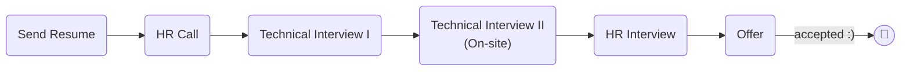

# [Visiwise](https://www.visiwise.co/)

### Status
#### 📜📞🔧🔧👱🏻‍♀️✅🎉

## Software Engineer

### Interview Process


### Apply Way
Email & LinkedIn & Jobinja & Jobvision

### Interview Date

- **Sent Resume**<br />1404.08.14

- **HR Call**<br />1404.09.05

- **Technical Interview I**<br />1404.09.06

- **Technical Interview II**<br />1404.09.16

- **HR Interview**<br />1404.09.24

- **Offer**<br />1404.10.01

### Interview Duration
- **Technical Interview I**<br />1 hours

- **Technical Interview II**<br />2 hours

- **HR Interview**<br />1 hours

### Interview Platform
Google Meet

### Technical Interview I

- Tell me about yourself.

- Why have you left your last company?

- What's the number of DAU in your last company?

- What's your salary expectation?

- In a microservices architecture, if one service depends on another and a failure occurs, how can the system handle the error and continue processing?
    <details>
    <summary style="font-size:14px"><b><em>Answer</em></b></summary>
    <div style="border:2px dashed #4a5568; padding:12px; border-radius:6px; margin-top:8px;  background-color: rgba(74,85,104,0.15);">

    Answer not provided
    i said atomic and trx outbox

    </div>
    </details>

- Suppose we have an international e-commerce system where users can submit orders. The challenge is calculating taxes, which vary based on time (e.g., Black Friday), product category (e.g., electronic goods), and country. How would you design the database(relational) to support this?
    <details>
    <summary style="font-size:14px"><b><em>Answer</em></b></summary>
    <div style="border:2px dashed #4a5568; padding:12px; border-radius:6px; margin-top:8px;  background-color: rgba(74,85,104,0.15);">

    Answer not provided

    </div>
    </details>

#### Live coding

- [Prefix Sum of Matrix](https://www.geeksforgeeks.org/dsa/prefix-sum-2d-array/?utm_source=chatgpt.com)
    <details>
    <summary style="font-size:14px"><b><em>My answer</em></b></summary>
    <div style="border:2px dashed #4a5568; padding:12px; border-radius:6px; margin-top:8px;  background-color: rgba(74,85,104,0.15);">

    ```python
    def matrix(board: list[list]) -> list[list]:
        new_board = []
        for i in range(len(board)):
            rows = []
            for i in range(len(board[0])):
                rows.append(0)
            new_board.append(rows)

        for i in range(len(board)):
            for j in range(len(board[0])):
                k = i
                v = j
                new_index = 0
                while k >= 0:
                    while v >= 0:
                        new_index += board[k][v]
                        v-=1
                    v = j
                    k -= 1
                new_board[i][j] = new_index
        return new_board

    test = [
        [1, 2, 3],
        [4, 5, 6],
        [7, 8, 9]
    ]
    res = matrix(test)
    print(res)
    ```
    </div>
    </details></br>
    <details>
    <summary style="font-size:14px"><b><em>Answer</em></b></summary>
    <div style="border:2px dashed #4a5568; padding:12px; border-radius:6px; margin-top:8px;  background-color: rgba(74,85,104,0.15);">

    ```python
    def prefixSum2D(arr):
        # number of rows
        n = len(arr)

        # number of columns
        m = len(arr[0])

        # Initialize prefix with 0s
        prefix = [[0] * m for _ in range(n)]

        # Compute prefix sum matrix
        for i in range(n):
            for j in range(m):

                # Start with original value
                prefix[i][j] = arr[i][j]

                # Add value from top cell if it exists
                if i > 0:
                    prefix[i][j] += prefix[i - 1][j]

                # Add value from left cell if it exists
                if j > 0:
                    prefix[i][j] += prefix[i][j - 1]

                # Subtract overlap from top-left diagonal if it exists
                if i > 0 and j > 0:
                    prefix[i][j] -= prefix[i - 1][j - 1]

        return prefix

    if __name__ == "__main__":
        arr = [
            [1, 2, 3, 4],
            [5, 6, 7, 8],
            [9, 10, 11, 12],
            [13, 14, 15, 16]
        ]

        prefix = prefixSum2D(arr)

        for row in prefix:
            print(" ".join(map(str, row)))
    ```
    </div>
    </details>

### Technical Interview II - Task (On-site)

<p dir="rtl">
تسکی به من داده شد (حضوری)، دو ساعت زمان داشتم و از هر ابزاری مانند سرچ، LLM و AI می‌تونستم استفاده کنم. فقط باید درست کار می‌کرد و این که مسئولیت کد نوشته شده با من بود.
<a href="./zibal_backend_project.pdf">تسک</a>
و  
<a href="https://github.com/mo1ein/zibal">پاسخ</a>
من.

</p>

#### System Design (Whiteboard design)
After Previous Technical Interview...
Congratulations! you have done your task. Let's scale it.
OK how you design this project for scale? What challenges might you will be facing it in scale? And How you design data pipeline and scrapper in sacle?

### HR Interview

### Score
<h4><mark style="background-color:#4caf50; color:#ffffff; padding:4px 8px; border-radius:4px">8.5/10</mark></h4>

<p dir="rtl">
فرآیند مصاحبه (فنی‌ها) خوب بود و سعی شده بود استاندارد باشه و یک مهندس نرم‌افزار خوب رو بسنجه هر چند به نظرم مقداری زیادی بود با توجه به این که شرکت کوچکی بود (ولی خب مشتری خارجی داشت، ساده‌ش کنم برنامه‌نویس ارزون از ایران بگیریم کانادایی پول دربیاریم خودمون) تک‌لیدی هم که باهام مصاحبه می‌کرد آدم خفن و نردی‌ بود، برخورد اوکی و محترمانه‌ای داشت و می‌شد حین مصاحبه هم یاد گرفت ازش. اما در مصاحبه HR وایبی که گرفتم وایب جالبی نبود دو نفر بودن یکی PM (یا PO نمی‌دونم من هیچ‌وقت نفهمیدم اینا رو! مهمم نیست) بود که همه کاره شرکت بود عملا و دیگری HR همیشه در صحنه. فضا، فضای مچ‌گیری بود انگار رفتم پیش ناظم مدرسه هر دو لپ‌تاپ جلوشون بود و هی سوال می‌پرسیدن و مثل تراپیستا یه چیزی یادداشت می‌کردن (گوگله انگار) و سوالا هم که همون تیپیکال‌های معمول که فقط باید از قبل حفظ کرده باشی به همراه خالی‌بندی جواب بااعتمادبه‌نفس بدی که خیلی خوب بودم تو این مورد چون مصاحبه زیاد می‌رم و بافتن راحته برام. ردفلگ قضیه این بود که اینا تو یه آگهی‌ای رنج زده بودن و تو مصاحبه من گفتم یه آفر دارم (و واقعا هم داشتم) و رنجم انقد زدین خودتون با توجه به اون آفرم و رنج خودتون من پیشنهادم این بازه‌س که فکر می‌کنم اوکی باشین hr برگشت گفت چیزه عه نه نه اونو همکارمون اشتباه زده فیلان رنج‌مون اون نیست (با لحنی که از این خبرا نیست داداش!) حالا من نیاز به کار داشتم ولی همون‌جا چند پله سقوط کردن برام.

</p>
<br />
<p dir="rtl">
مدت زیادی نبودم تو شرکت چون خورد به جنگ و قطعی اینترنت و کلا شرکت رفت رو هوا و شروع کرد به لی‌آف و تا می‌تونست نیروهاشو برد اون‌ طرف که بتونه ادامه بده. اما مشاهداتم تو همون بازه رو می‌نویسم.
شرکت دودفتری بود یعنی یه حقوق وزارت کاری می‌داد یه حقوق واقعی که اون واقعیه دلاری بود (یعنی رو هم رفته اندازه شرکت خوب ایرانی نمی‌شد مثل اسنپ! و امثالهم) که هر جا گیر می‌کرد و شرایط کشور بهم می‌ریخت اون وزارت کاریه رو می‌داد و دلاری پرپر می‌شد. فضای خود شرکت خوب بود بچه‌ها مشتی و خوب بودن، از نظر فنی هم اوکی بود. از نظر فشار کاری هم چیل و چال بود قشنگ عقربه میومد رو ساعت ۶ همه جلو آسانسور بودن و این خیلی زیبا بود. یه ردفلگ گنده هم که دیدم این بود که پروداکت همه کاره و boss بود. هر چی اون می‌گفت باید اجرا می‌شد حتی دسترسی‌ها و دسترسی مثلا دیتابیس رو پروداکت باید می‌داد!!! طبق تجربه‌ای که داشتم معمولا CTO رئیس بود همیشه ولی این‌جا اون مدلی نبود و خب کدبیس قدیمی رو که دیدم فهمیدم چرا اون‌جوری شده. قشنگ بزن فقط کار کنه و چون کار می‌کنه دست نزن بود.

</p>
<p dir="rtl">
در کل از خیلی جاها بهتر بود ولی عالی نبود.
</p>

