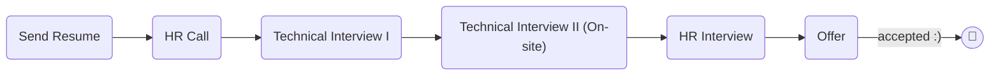

# [Visiwise](https://www.visiwise.co/)

### Status
#### 📜📞🔧🔧👱🏻‍♀️✅🎉

## Software Engineer

### Interview Process


### Apply Way
Email & LinkedIn & Jobinja & Jobvision

### Interview Date

- **Sent Resume**<br />1404.08.14

- **HR Call**<br />1404.09.05

- **Technical Interview I**<br />1404.09.06

- **Technical Interview II**<br />1404.09.16

- **HR Interview**<br />1404.09.24

- **Offer**<br />1404.10.01

### Interview Duration
- **Technical Interview I**<br />1 hours

- **Technical Interview II**<br />2 hours

- **HR Interview**<br />1 hours

### Interview Platform
Google Meet

### Technical Interview I

- Tell me about yourself.

- Why have you left your last company?

- What's the number of DAU in your last company?

- What's your salary expectation?

- In a microservices architecture, if service A depends on service B and a failure occurs mid-request (e.g., user balance is checked in A, then A calls B to deduct from the wallet, but B fails), how do you handle it?

  > **Follow-up:** With atomic flows... Where does atomicity and rollback happen, and at what level do you solve this?

  <details>
  <summary style="font-size:14px"><b><em>Answer</em></b></summary>
  <div>

  **Where atomicity happens:**

  Atomicity is per-service, not cross-service. Each service has its own local transaction. If A commits but B fails, A's state is already written — you need a pattern to reconcile.

  **Solutions by level:**

  | Level | Pattern | Atomicity Scope |
  |-------|---------|-----------------|
  | **Database** | Local transactions | Single service only |
  | **Messaging** | Transactional Outbox | Guarantees event delivery, not instant consistency |
  | **Saga** | Compensation steps | Logical atomicity via rollback handlers |
  | **API** | Retry + idempotency | Best-effort, transient failure recovery |

  **Transactional Outbox (recommended):**

  ```
  Service A:
  1. BEGIN TRANSACTION
     - INSERT into orders
     - INSERT into outbox (event: "deduct_wallet")
  2. COMMIT TRANSACTION (atomic — both succeed or both fail)
  3. Outbox poller → Kafka/RabbitMQ
  ```

  ```
  Service B:
  1. Consume message
  2. Idempotency check (event_id)
  3. BEGIN TRANSACTION
     - UPDATE wallet SET balance = balance - amount
     - INSERT into processed_events
  4. COMMIT TRANSACTION
  ```

  **Failure recovery:**

  | Failure Point | Recovery |
  |---------------|----------|
  | A's DB commit fails | Full rollback — no side effects |
  | A's outbox poll fails | Event stays in outbox, retried |
  | B fails to process | Message retried by broker |
  | B processes twice | Idempotency check rejects duplicate |

  **Saga (for multi-step flows):**

  ```
  Order Saga:
    Step 1: Create order      → compensation: cancel order
    Step 2: Deduct wallet     → compensation: refund wallet
    Step 3: Reserve inventory → compensation: release inventory

  If Step 3 fails:
    → refund wallet (Step 2 reverse)
    → cancel order (Step 1 reverse)
  ```

  **Key takeaway:** Atomicity in microservices is **per-service** (local DB transactions). Cross-service consistency is achieved through eventual consistency patterns (Saga, Outbox), not distributed transactions (2PC).

  </div>
  </details>

- Suppose we have an international e-commerce system where users can submit orders. The challenge is calculating taxes and discounts, which vary based on country, time (e.g., Black Friday), and product category (e.g., electronic goods). We must display prices based on the user's country — for example, someone in the US should see prices in dollars, while someone in the UK should see the same product in British pounds. Additionally, we need to track which user placed which order, with which discount, tax, and currency applied. How would you design a relational database to support this?

  <details>
  <summary style="font-size:14px"><b><em>Answer</em></b></summary>
  <div>

  Before diving into tables, let me surface assumptions:
  1. Relational DB (PostgreSQL recommended)
  2. Base currency is configurable per product via `base_currency_id`
  3. Prices can have country-specific overrides
  4. Tax/discount rules are time-bound (start/end dates)
  5. Orders must be immutable snapshots for audit
  6. Exchange rates are versioned, never updated in place

  ---

  **Schema Design (10 tables):**

  ```sql
  -- Reference data ------------------------------------------------------

  CREATE TABLE currencies (
      id      SERIAL PRIMARY KEY,
      code    CHAR(3) UNIQUE NOT NULL,     -- 'USD', 'GBP'
      symbol  VARCHAR(5) NOT NULL
  );

  CREATE TABLE countries (
      id           SERIAL PRIMARY KEY,
      iso_code     CHAR(2) UNIQUE NOT NULL,
      name         VARCHAR(100) NOT NULL,
      currency_id  INT NOT NULL REFERENCES currencies(id)
  );

  -- Versioned FX rates — NEVER update in place, always insert a new row
  CREATE TABLE exchange_rates (
      id                SERIAL PRIMARY KEY,
      from_currency_id  INT NOT NULL REFERENCES currencies(id),
      to_currency_id    INT NOT NULL REFERENCES currencies(id),
      rate              NUMERIC(18,8) NOT NULL,
      effective_date    DATE NOT NULL,
      UNIQUE (from_currency_id, to_currency_id, effective_date)
  );

  -- Users ----------------------------------------------------------------

  CREATE TABLE users (
      id          SERIAL PRIMARY KEY,
      email       VARCHAR(150) UNIQUE NOT NULL,
      country_id  INT NOT NULL REFERENCES countries(id),
      created_at  TIMESTAMPTZ DEFAULT now()
  );

  -- Catalog ----------------------------------------------------------------

  CREATE TABLE categories (
      id    SERIAL PRIMARY KEY,
      name  VARCHAR(100) NOT NULL
  );

  CREATE TABLE products (
      id                SERIAL PRIMARY KEY,
      name              VARCHAR(200) NOT NULL,
      category_id       INT NOT NULL REFERENCES categories(id),
      base_price        NUMERIC(12,2) NOT NULL,
      base_currency_id  INT NOT NULL REFERENCES currencies(id),
      created_at        TIMESTAMPTZ DEFAULT now()
  );

  -- Country-specific STRATEGIC price override (not just FX conversion)
  -- e.g. deliberately pricing lower in an emerging market
  CREATE TABLE product_prices (
      id          SERIAL PRIMARY KEY,
      product_id  INT NOT NULL REFERENCES products(id),
      country_id  INT NOT NULL REFERENCES countries(id),
      price       NUMERIC(12,2) NOT NULL,
      valid_from  DATE NOT NULL,
      valid_to    DATE,
      UNIQUE (product_id, country_id, valid_from)
  );

  -- Policy: tax ---------------------------------------------------------

  CREATE TABLE tax_rules (
      id            SERIAL PRIMARY KEY,
      country_id    INT NOT NULL REFERENCES countries(id),
      category_id   INT REFERENCES categories(id),   -- NULL = all categories
      rate_percent  NUMERIC(5,2) NOT NULL,
      valid_from    DATE NOT NULL,
      valid_to      DATE
  );

  -- Policy: discount ------------------------------------------------------

  CREATE TABLE discount_rules (
      id             SERIAL PRIMARY KEY,
      name           VARCHAR(150) NOT NULL,             -- 'Black Friday 2026'
      discount_type  VARCHAR(10) NOT NULL CHECK (discount_type IN ('PERCENT','FIXED','BOGO')),
      value          NUMERIC(12,2) NOT NULL,
      min_purchase   NUMERIC(12,2),                      -- optional threshold
      country_id     INT REFERENCES countries(id),        -- NULL = global
      category_id    INT REFERENCES categories(id),        -- NULL = all categories
      valid_from     TIMESTAMPTZ NOT NULL,
      valid_to       TIMESTAMPTZ NOT NULL
  );

  -- Transactional core (immutable once placed) ---------------------------

  CREATE TABLE orders (
      id              SERIAL PRIMARY KEY,
      user_id         INT NOT NULL REFERENCES users(id),
      currency_id     INT NOT NULL REFERENCES currencies(id),
      fx_rate_used    NUMERIC(18,8) NOT NULL,       -- snapshot: prevents FX drift on old invoices
      subtotal        NUMERIC(12,2) NOT NULL,
      tax_total       NUMERIC(12,2) NOT NULL,
      discount_total  NUMERIC(12,2) NOT NULL,
      grand_total     NUMERIC(12,2) NOT NULL,
      status          VARCHAR(20) NOT NULL DEFAULT 'PENDING',
      placed_at       TIMESTAMPTZ DEFAULT now()
  );

  CREATE TABLE order_items (
      id                        SERIAL PRIMARY KEY,
      order_id                  INT NOT NULL REFERENCES orders(id),
      product_id                INT NOT NULL REFERENCES products(id),
      quantity                  INT NOT NULL CHECK (quantity > 0),

      unit_price_snapshot       NUMERIC(12,2) NOT NULL,

      tax_rule_id               INT REFERENCES tax_rules(id),        -- traceability
      tax_rate_snapshot         NUMERIC(5,2) NOT NULL,
      tax_amount_snapshot       NUMERIC(12,2) NOT NULL,

      discount_rule_id          INT REFERENCES discount_rules(id),   -- traceability, nullable
      discount_amount_snapshot  NUMERIC(12,2) NOT NULL DEFAULT 0,

      line_total                NUMERIC(12,2) NOT NULL
  );
  ```

  **Entity-Relationship Diagram:**

  ```mermaid
  erDiagram
      currencies ||--o{ countries : "used by"
      currencies ||--o{ exchange_rates : "from currency"
      currencies ||--o{ exchange_rates : "to currency"
      currencies ||--o{ products : "base currency"
      currencies ||--o{ orders : "order currency"

      countries ||--o{ product_prices : "has pricing"
      countries ||--o{ tax_rules : "defines tax"
      countries ||--o{ discount_rules : "defines discount"
      countries ||--o{ users : "resides in"

      categories ||--o{ products : "categorizes"
      categories ||--o{ product_prices : "category pricing"
      categories ||--o{ tax_rules : "category tax"
      categories ||--o{ discount_rules : "category discount"

      products ||--o{ product_prices : "price overrides"
      products ||--o{ order_items : "sold as"

      tax_rules ||--o{ order_items : "traced to"
      discount_rules ||--o{ order_items : "traced to"

      users ||--o{ orders : "places"
      orders ||--o{ order_items : "contains"

      currencies {
          int id PK
          char(3) code UK "ISO 4217"
          varchar symbol
      }

      countries {
          int id PK
          char(2) iso_code UK "ISO 3166-1"
          varchar name
          int currency_id FK
      }

      exchange_rates {
          int id PK
          int from_currency_id FK
          int to_currency_id FK
          numeric rate
          date effective_date
      }

      users {
          int id PK
          varchar email UK
          int country_id FK
          timestamp created_at
      }

      categories {
          int id PK
          varchar name
      }

      products {
          int id PK
          varchar name
          int category_id FK
          numeric base_price
          int base_currency_id FK
          timestamp created_at
      }

      product_prices {
          int id PK
          int product_id FK
          int country_id FK
          numeric price
          date valid_from
          date valid_to
      }

      tax_rules {
          int id PK
          int country_id FK
          int category_id FK "nullable"
          numeric rate_percent
          date valid_from
          date valid_to
      }

      discount_rules {
          int id PK
          varchar name
          varchar discount_type "PERCENT|FIXED|BOGO"
          numeric value
          numeric min_purchase
          int country_id FK "nullable"
          int category_id FK "nullable"
          timestamp valid_from
          timestamp valid_to
      }

      orders {
          int id PK
          int user_id FK
          int currency_id FK
          numeric fx_rate_used "snapshot"
          numeric subtotal
          numeric tax_total
          numeric discount_total
          numeric grand_total
          varchar status
          timestamp placed_at
      }

      order_items {
          int id PK
          int order_id FK
          int product_id FK
          int quantity
          numeric unit_price_snapshot
          int tax_rule_id FK "traceability"
          numeric tax_rate_snapshot
          numeric tax_amount_snapshot
          int discount_rule_id FK "traceability nullable"
          numeric discount_amount_snapshot
          numeric line_total
      }
  ```


  **Price Calculation Flow:**

  ```
  User (country=GB) views Product X (category=Electronics)
          │
          ▼
  Is there a product_prices override for (Product X, GB)? ──yes──▶ use override price
          │no
          ▼
  base_price × exchange_rates[product.base_currency_id → user.country.currency_id, today]
          │
          ▼
  Resolve active tax_rule: country=GB, category=Electronics (fallback: category IS NULL)
          │
          ▼
  Resolve active discount_rule: country=GB or global, category=Electronics or all,
  today ∈ [valid_from, valid_to], min_purchase satisfied
          │
          ▼
  discount_amount = apply(discount_rule, price)
  tax_amount      = (price - discount_amount) × rate_percent / 100
  line_total      = price - discount_amount + tax_amount
          │
          ▼
  Display in GBP  ──────(user clicks buy)──────▶  INSERT orders
                                                    fx_rate_used = effective_rate
                                                    subtotal, tax_total, discount_total, grand_total
                                                  INSERT order_items
                                                    unit_price_snapshot, tax_rule_id,
                                                    tax_rate_snapshot, tax_amount_snapshot,
                                                    discount_rule_id, discount_amount_snapshot,
                                                    line_total  (all frozen)
  ```


  **Key Design Decisions:**

  | Decision | Rationale |
  |----------|-----------|
  | **Currencies as first-class table** | Decouples currency metadata (code, symbol) from countries. Multiple countries can share a currency (e.g., EUR in Germany/France). |
  | **Versioned exchange rates** | `exchange_rates` with `effective_date` — never update in place, always insert new row. Enables historical queries: "What was USD→GBP on 2024-11-25?" |
  | **Snapshot at order time** | `order_items` stores `tax_rule_id`, `tax_rate_snapshot`, `tax_amount_snapshot`, `discount_rule_id`, `discount_amount_snapshot`, `line_total`. Traceability via FKs + immutable values. |
  | **fx_rate_used in orders** | Captures the exact FX rate at order time. Prevents FX drift on old invoices when rates change. |
  | **Time-bound rules** | `valid_from`/`valid_to` on tax_rules and discount_rules enable point-in-time queries. |
  | **Price override table** | `product_prices` allows country-specific strategic pricing beyond FX conversion (e.g., emerging market pricing). |
  | **CHECK on discount_type** | `CHECK (discount_type IN ('PERCENT','FIXED','BOGO'))` enforces valid types at DB level. |


  **Performance Considerations:**

  ```sql
  -- Critical indexes
  CREATE INDEX idx_exchange_rates_lookup  ON exchange_rates(from_currency_id, to_currency_id, effective_date DESC);
  CREATE INDEX idx_tax_rules_lookup       ON tax_rules(country_id, category_id, valid_from, valid_to);
  CREATE INDEX idx_discount_rules_lookup  ON discount_rules(country_id, category_id, valid_from, valid_to);
  CREATE INDEX idx_product_prices_lookup  ON product_prices(product_id, country_id, valid_from, valid_to);
  CREATE INDEX idx_orders_user            ON orders(user_id, placed_at);
  CREATE INDEX idx_order_items_order      ON order_items(order_id);
  ```

  **Query example — get active tax rule:**
  ```sql
  SELECT rate_percent FROM tax_rules
  WHERE country_id = 1
    AND category_id = 2
    AND valid_from <= CURRENT_DATE
    AND (valid_to IS NULL OR valid_to >= CURRENT_DATE);
  ```

  **Query example — get today's FX rate:**
  ```sql
  SELECT rate FROM exchange_rates
  WHERE from_currency_id = 1   -- USD
    AND to_currency_id = 2     -- GBP
    AND effective_date <= CURRENT_DATE
  ORDER BY effective_date DESC
  LIMIT 1;
  ```


  **Doubt-Driven Review:**

  | Potential Issue | Mitigation |
  |-----------------|------------|
  | FX rate changes between view and checkout | `fx_rate_used` snapshot in `orders` locks the rate at purchase time |
  | Overlapping discount rules | Application-level validation; DB UNIQUE constraint on `(country_id, category_id, valid_from)` |
  | NULL category_id ambiguity | `tax_rules.category_id IS NULL` means "all categories" — document this clearly |
  | Currency conversion rounding | Use `NUMERIC(18,8)` for rates, `NUMERIC(12,2)` for final amounts |
  | Stale exchange rates | Always `ORDER BY effective_date DESC LIMIT 1`; flag rates older than 24h |

  </div>
  </details>

- How do you store money?

  <details>
  <summary style="font-size:14px"><b><em>Answer</em></b></summary>
  <div>

  Never use floating-point types (FLOAT, DOUBLE) for money. Use fixed-point precision:

  **NUMERIC vs DECIMAL:**

  | Database | NUMERIC | DECIMAL | Notes |
  |----------|---------|---------|-------|
  | PostgreSQL | Exact numeric type | Alias for NUMERIC | Same type, same behavior |
  | MySQL | Synonym for DECIMAL | Standard SQL type | DECIMAL is preferred |
  | SQL Server | Not supported | Standard type | Use DECIMAL |

  `DECIMAL` is the SQL standard; `NUMERIC` is PostgreSQL's name for the same thing. Both store exact values with no rounding errors. Use `DECIMAL` for portability across databases.

  **Storage for money:**

  ```sql
  -- Prices and totals
  DECIMAL(12,2)    -- up to 999,999,999.99

  -- Exchange rates (higher precision)
  DECIMAL(18,8)    -- for crypto or FX rates

  -- Tax rates
  DECIMAL(5,2)     -- 0.00 to 999.99 percent
  ```

  **In application code:**

  ```python
  from decimal import Decimal, ROUND_HALF_UP

  price = Decimal("19.99")
  tax = Decimal("0.0825")
  total = (price * (1 + tax)).quantize(Decimal("0.01"), rounding=ROUND_HALF_UP)
  # total = Decimal("21.64") ✅

  # ❌ Never do this
  total = 19.99 * 1.0825  # 21.6387025 — rounding nightmare
  ```

  **Why not FLOAT/DOUBLE:**

  ```python
  0.1 + 0.2 == 0.3       # False!
  0.1 + 0.2               # 0.30000000000000004
  Decimal("0.1") + Decimal("0.2") == Decimal("0.3")  # True ✅
  ```

  **Summary:** Use `DECIMAL` (SQL standard) or `NUMERIC` (PostgreSQL). Never use FLOAT/DOUBLE for financial data. Always round at the display layer.

  </div>
  </details>


#### Live coding

- [Prefix Sum of Matrix](https://www.geeksforgeeks.org/dsa/prefix-sum-2d-array/?utm_source=chatgpt.com)

  <details>
  <summary style="font-size:14px"><b><em>My answer</em></b></summary>
  <div>

  ```python
  def matrix(board: list[list]) -> list[list]:
      new_board = []
      for i in range(len(board)):
          rows = []
          for i in range(len(board[0])):
              rows.append(0)
          new_board.append(rows)

      for i in range(len(board)):
          for j in range(len(board[0])):
              k = i
              v = j
              new_index = 0
              while k >= 0:
                  while v >= 0:
                      new_index += board[k][v]
                      v-=1
                  v = j
                  k -= 1
              new_board[i][j] = new_index
      return new_board

  test = [
      [1, 2, 3],
      [4, 5, 6],
      [7, 8, 9]
  ]
  res = matrix(test)
  print(res)
  ```
  </div>
  </details></br>

  <details>
  <summary style="font-size:14px"><b><em>Answer</em></b></summary>
  <div>

  ```python
  def prefixSum2D(arr):
      # number of rows
      n = len(arr)

      # number of columns
      m = len(arr[0])

      # Initialize prefix with 0s
      prefix = [[0] * m for _ in range(n)]

      # Compute prefix sum matrix
      for i in range(n):
          for j in range(m):

              # Start with original value
              prefix[i][j] = arr[i][j]

              # Add value from top cell if it exists
              if i > 0:
                  prefix[i][j] += prefix[i - 1][j]

              # Add value from left cell if it exists
              if j > 0:
                  prefix[i][j] += prefix[i][j - 1]

              # Subtract overlap from top-left diagonal if it exists
              if i > 0 and j > 0:
                  prefix[i][j] -= prefix[i - 1][j - 1]

      return prefix

  if __name__ == "__main__":
      arr = [
          [1, 2, 3, 4],
          [5, 6, 7, 8],
          [9, 10, 11, 12],
          [13, 14, 15, 16]
      ]

      prefix = prefixSum2D(arr)

      for row in prefix:
          print(" ".join(map(str, row)))
  ```
  </div>
  </details>

### Technical Interview II - Task (On-site)

<p dir="rtl">
تسکی به من داده شد (حضوری)، دو ساعت زمان داشتم و از هر ابزاری مانند سرچ، LLM و AI می‌تونستم استفاده کنم. فقط باید درست کار می‌کرد و این که مسئولیت کد نوشته شده با من بود. همون فایل رو دادم AI و یکمی هم وقت تلف کردم الکی که انگار دارم خودم می‌زنم.
<a href="https://github.com/mo1ein/jobname/visiwise/visiwise-tracking-assignment/interview-assignment.md">تسک</a>
و  
<a href="https://github.com/mo1ein/jobname/visiwise/visiwise-tracking-assignment/">پاسخ</a>
من.

</p>

#### System Design (Whiteboard design)

After the previous technical interview, they said: "Congratulations, you've completed the task. Now let's scale it." They asked three questions:

1. How would you design this project for scale?
2. What challenges might you face at scale?
3. How would you design the data pipeline and scraper at scale?

### HR Interview
Typical HR obivious questions!

### Score
<h4><mark style="background-color:#4caf50; color:#ffffff; padding:4px 8px; border-radius:4px">8.5/10</mark></h4>

<p dir="rtl">
فرآیند مصاحبه (فنی‌ها) خوب بود و سعی شده بود استاندارد باشه و یک مهندس نرم‌افزار خوب رو بسنجه هر چند به نظرم مقداری زیادی بود با توجه به این که شرکت کوچکی بود (ولی خب مشتری خارجی داشت، ساده‌ش کنم برنامه‌نویس ارزون از ایران بگیریم کانادایی پول دربیاریم خودمون) تک‌لیدی هم که باهام مصاحبه می‌کرد آدم خفن و نردی‌ بود، برخورد اوکی و محترمانه‌ای داشت و می‌شد حین مصاحبه هم یاد گرفت ازش. اما در مصاحبه HR وایبی که گرفتم وایب جالبی نبود دو نفر بودن یکی PM (یا PO نمی‌دونم من هیچ‌وقت نفهمیدم اینا رو! مهمم نیست) بود که همه کاره شرکت بود عملا و دیگری HR همیشه در صحنه. فضا، فضای مچ‌گیری بود انگار رفتم پیش ناظم مدرسه هر دو لپ‌تاپ جلوشون بود و هی سوال می‌پرسیدن و مثل تراپیستا یه چیزی یادداشت می‌کردن (گوگله انگار) و سوالا هم که همون تیپیکال‌های معمول که فقط باید از قبل حفظ کرده باشی به همراه خالی‌بندی جواب بااعتمادبه‌نفس بدی که خیلی خوب بودم تو این مورد چون مصاحبه زیاد می‌رم و بافتن راحته برام. ردفلگ قضیه این بود که اینا تو یه آگهی‌ای رنج زده بودن و تو مصاحبه من گفتم یه آفر دارم (و واقعا هم داشتم) و رنجم انقد زدین خودتون با توجه به اون آفرم و رنج خودتون من پیشنهادم این بازه‌س که فکر می‌کنم اوکی باشین hr برگشت گفت چیزه عه نه نه اونو همکارمون اشتباه زده فیلان رنج‌مون اون نیست (با لحنی که از این خبرا نیست داداش!) حالا من نیاز به کار داشتم ولی همون‌جا چند پله سقوط کردن برام.

</p>
<br />
<p dir="rtl">
مدت زیادی نبودم تو شرکت چون خورد به جنگ و قطعی اینترنت و کلا شرکت رفت رو هوا و شروع کرد به لی‌آف و تا می‌تونست نیروهاشو برد اون‌ طرف که بتونه ادامه بده. اما مشاهداتم تو همون بازه رو می‌نویسم.
شرکت دودفتری بود یعنی یه حقوق وزارت کاری می‌داد یه حقوق واقعی که اون واقعیه دلاری بود (یعنی رو هم رفته اندازه شرکت خوب ایرانی نمی‌شد مثل اسنپ! و امثالهم) که هر جا گیر می‌کرد و شرایط کشور بهم می‌ریخت اون وزارت کاریه رو می‌داد و دلاری پرپر می‌شد. فضای خود شرکت خوب بود بچه‌ها مشتی و خوب بودن، از نظر فنی هم اوکی بود. از نظر فشار کاری هم چیل و چال بود قشنگ عقربه میومد رو ساعت ۶ همه جلو آسانسور بودن و این خیلی زیبا بود. یه ردفلگ گنده هم که دیدم این بود که پروداکت همه کاره و boss بود. هر چی اون می‌گفت باید اجرا می‌شد حتی دسترسی‌ها و دسترسی مثلا دیتابیس رو پروداکت باید می‌داد!!! طبق تجربه‌ای که داشتم معمولا CTO رئیس بود همیشه ولی این‌جا اون مدلی نبود و خب کدبیس قدیمی رو که دیدم فهمیدم چرا اون‌جوری شده. قشنگ بزن فقط کار کنه و چون کار می‌کنه دست نزن بود.

</p>
<p dir="rtl">
در کل از خیلی جاها بهتر بود ولی عالی نبود.
</p>

