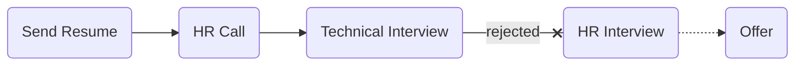

# [wallex](https://wallex.ir)

### Status
#### 📜📞🔧❌
## Junior Backend Developer
### Interview process

### Apply way
Site & Linkedin & Refer :)

### Interview date
- **Sent Resume**   1402.08.08

- **HR Call**  1402.08.16

- **Technical Interview**   1402.08.21 AT 1 PM

- **Rejection Email**   1402.09.11

### Interview duration
- **Technical Interview**  1 hour & 10 minutes

### Interview Platform
Google Meet

### Technical Interview

مصاحبه با دو نفر بود که هر دو فنی بودن.

- Tell us about yourself.

- Can you tell me the software layers that a request goes through in our code, and where it ends up?

- What is ORM?

- What is REST?

- Suppose we want to sent 1 million notification and need request it to db how u handle it?

- When we want to know a user authenticated or not for some action, how know that and how we handle that?

- Can you example of some tables with one-to-one one-to-many many-to-many many-to-one?

- Consider we have some tables and we have fk in each... // TODO

- What is design pattern? Why is it good?

- What is SOLID?

- What is dependency inversion?

- Example dependency inversion in real world.

- Example dependency inversion in code. interface go ro gofram

- When do you use a cache?

- Is TDD OK? If I say we don't need to write tests, what's your reaction in a team?

- Have you ever experienced the joy of writing a test that fixes a bug and makes you happy?

- What languages Are you familiar with?

- Are you OK with php? Our stack is php.

- What disturbs you at work?

- What are your main reasons for wanting to work at a different company?

- What was your git flow at your previous company? Why did you not choose to rebase instead of merging the master branch with your task branch

- Any question? what is your team structure

## Score
<h4><mark style="background-color:#54ca56">8/10</mark></h4>

سوالای خوبی پرسیدن که پایه مهندسی نرم‌افزار داشت نه فریموورک و زبان و ابزار. سوالای دیتابیسی و اون سوال یک میلیون ریکوئست رو خوب جواب ندادم و به نظرم همون فاتحمو خوند. به جز اینا مشکلی تو بقیه موارد نداشتم. فقط یه مورد عجیب دیدم که هنوزم برام خنده‌داره. بعد مصاحبه حدود چند هفته گذشت و خبری نشد. بوی ریجکتی و گوست شدن میومد قشنگ. اما هرگز همینجوری شل نگیرید، پیگیر باشید و موقع نتیجه هم فیدبک بخواید. فیدبک خواستنیه و گرفتنی کسی فیدبک نمی‌ده باید بگیریش. شرکت خوبیم بود تمام زورمو می‌خواستم بزنم یه جورایی. تو لینکدین به hr پیام دادم پس چی شد نتیجه مصاحبه ما؟ (حالا اینجوری نه منطقا) فورا بعد چند دقیقه زنگ زد و عذرخواهی و اینا که دیر شده و گفت پوزیشن hold شده و شما هم overqualified شدی سطح‌تون بالا بوده و تو لول مید هستید و فراتر از جونیورید. خیلی جلوی خندمو نگه داشتم. به نظرم اینجوری گفت که مثلا ناراحت نشم و این حرفا وگرنه من خودم می‌دونم که سگ‌جونیورم، سابقه کاریم مشخصه خب. البته که مودب و محترم صحبت می‌کرد. برای شرکتی تو این سطح بعیده. شگفت‌انگیز!

