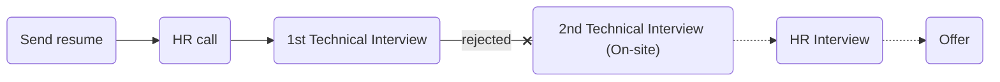

# [yektanet](https://yektanet.com)

### Status
#### 📜📞🔧❌
## Software Engineer
### Interview process


### Apply way
Site & jobinja

### Interview Date
- **Sent Resume** <br /> 1402.08.05

- **HR Call**<br /> 1402.08.27

- **Technical Interview** <br> 1402.08.30 AT 4 PM

- **Rejection Email** <br /> 1402.09.15

### Interview Duration
30 minutes

### Interview Platform
Google Meet


### HR Call
<p dir="rtl">اچ‌آر زنگ زد یه ۱۵ دقیقه‌ای حرف زدیم. داشت رزومه رو دابل‌چک می‌کرد و هر چی که نوشته بودم رو می‌خوند و یه علامت سوال می‌ذاشت جلوش.</p>
<ul dir="rtl">
	<li>دانشگاهت فلان جا بوده؟</li>
	<li>شرکت قبلیت اینجا بوده؟</li>
	<li>چرا دراومدی؟</li>
	<li>حقوقت اونجا چقد بوده و اینجا پیشنهادت چقده؟</li>
	<li>شرایط کار حضوری دارید؟</li>
	<li>سربازیت در چه وضعیه؟</li>
	<li>قصد مهاجرت داری؟</li>
	<li>یک ماه فرآیند مصاحبه طول می‌کشه اوکی‌ای؟</li>
	<li>بعدش شروع کرد به توضیح دادن فرآیند مصاحبه که مصاحبه اول تکنیکاله و الگوریتمی و آنلاین، مصاحبه دوم هم تکنیکاله و حضوری و مصاحبه سوم HR </li>
</ul>

### Technical Interview
#### Live code

<p dir="rtl">از اینترنت نمی‌شد استفاده کرد ولی از مصاحبه‌کننده می‌شد سوال کرد. <br /> مصاحبه کوتاهی بود که هیچ معرفی و اینام نداشت و دو تا سوال تو گوگل داک نوشته بودن که همون جا کد میزدم. سوالاش و جوابای من، اینا بود:</p>

<ul dir="rtl">
    <li>تابعی بنویسید که عدد n را ورودی بگیرد. اگر عدد به 15 بخش‌پذیر بود، عبارت FizzBuzz، اگربه 3 بخش‌پذیر بود، عبارت Fizz و اگر به 5 بخش‌پذیر بود، عبارت Buzz را چاپ کند.</li>
</ul>

```python
def check_buzz(n: int) -> str | None:
    if n % 15 == 0:
        return "FizzBuzz"
    if n % 3 == 0:
        return "Fizz"
    if n % 5 == 0:
        return "Buzz"
    return None

```

- [two sum](https://leetcode.com/problems/two-sum/)

My first answer with o(n ^ 2)

```python
def check_2sum(nums: list, k: int) -> tuple:
    index = 0
    for item in nums:
        for item_2 in nums[index +1:]:
            if item_2 + item == k:
                return item, item_2
        index +=1
```

My second answer with O(n)

```python
def check_2sum(nums: list, k: int) -> tuple:
    map_ = {}
    for i in range(len(nums)):
        map_[nums[i]] = i

    for i in range(len(nums)):
        target = k - nums[i]
        if target in map_ and map_[target] != i:
            return nums[i], nums[map_[target]]
```
Best answer (one loop)
```python
def twosum(nums: list[int], target: int) -> list[int]:
    num_map = {}  # Hash table to store number and its index
    for i, num in enumerate(nums):
        complement = target - num  # Find the complement
        if complement in num_map:
            return [num_map[complement], i]  # Return indices of complement and current number
        num_map[num] = i  # Store the number with its index
```
<p dir="rtl">
قسمت <code>return</code> رو فکر کنم اشتباه نوشتم به نظرم <code>i</code> نوشته بودم جای <code>nums[i]</code>. حالا خیلی مهم نیس منطق و روش درسته و خودشونم گفته بودن syntax مهم نیست.
</p>

### Score
<h4><mark style="background-color:#ffd700">5/10</mark></h4>
<p dir="rtl">
هر دو سوال رو درست زدم. گر چه سوال دوم برای روش بهینه‌ش رو یه مقدار بیشتر فکر کردم چون یه بار زده بودم، داشتم یادم میاوردم و می‌دونستم باید hash map طور برم جلو. اون ایده فور دوم یه مقدار با زور اومد ذهنم ولی اومد در نهایت، زدم و اوکی هم بود. نت آن‌استیبلی هم داشتم از شانس ولی یه درصدم فکر نمی‌کردم ریجکت شه. انتظار اینو داشتم حداقل یه مرحله جلو بره. بعد از چند هفته به hr ایمیل زدم و جوابی نمی‌داد یه جواب سرسری داد که من الان سیستم پیشم نیس چند روز دیگه خبر می‌دم. مثل این که ایمیل شرکتی‌شون نیومده بود و چند روز دنبال‌شون بودم که بهم بگن ریجکت شدی! بعدش ایمیلو خودش فرستاد. hr نوبی بود خلاصه. سیستم مصاحبه‌شون اینجوری کار می‌کنه: ریفر +‌ خفه کردن با الگوریتم. اگر سابقه کاری هم نداشته باشید، ندید کنسلید (احتمالا به جز ریفرا). یه چیز دیگه‌ایم که خیلی از اونایی که اونجا بودن شنیدم، فشار کاری بالا و عدم وجود تعادل بین کار و زندگیه. طوری که از کلمه‌های برده و حیوانات اهلی دربارش استفاده می‌کنن. اما پول خوبی می‌دن. حقوق پیشنهادی که پشت تلفن گفتم، ۵تا گذاشتم رو حقوق خودم و برای اونجا یه ۱۰تام اومدم روش و یه ۵تای دیگم جهت بازه بین این و آن (بکنید از این کارا، حال می‌ده (:) که خب می‌دونستم مشکل مالی ندارن ولی با این حال گفتم الان تلفنو قطع می‌کنه! بدین صورت. نمره‌ای که دادم هم قابل مشاهده‌ست.
</p>
