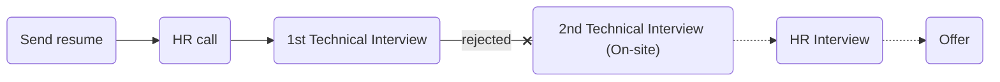

# [yektanet](https://yektanet.com)

### Status
#### 📜📞🔧❌
## Software Engineer
### Interview process


### Apply way
Site & jobinja

### Interview Date
- **Sent Resume** <br /> 1402.08.05

- **HR Call**<br /> 1402.08.27

- **Technical Interview** <br> 1402.08.30 AT 4 PM

- **Rejection Email** <br /> 1402.09.15

### Interview Duration
30 minutes

### Interview Platform
Google Meet

### Technical Interview
#### Live code

<p dir="rtl">از اینترنت نمی‌شد استفاده کرد ولی از مصاحبه‌کنده می‌شد سوال کرد.</p>
<p dir="rtl">کل مصاحبه نیم ساعت بود که هیچ معرفی و اینام نداشت و دو تا سوال تو گوگل داک نوشته بودن که همون جا کد میزدم سوالاش اینا بود</p>

<ul dir="rtl">
    <li>تابعی بنویسید که عدد n را ورودی بگیرد. اگر عدد به 15 بخش‌پذیر بود، عبارت FizzBuzz، اگربه 3 بخش‌پذیر بود، عبارت Fizz و اگر به 5 بخش‌پذیر بود، عبارت Buzz را چاپ کند.</li>
</ul>

```python
def check_buzz(n: int) -> str | None:
    if n % 15 == 0:
        return "FizzBuzz"
    if n % 3 == 0:
        return "Fizz"
    if n % 5 == 0:
        return "Buzz"
    return None

```

- [two sum](https://leetcode.com/problems/two-sum/)

my first answer with o(n ^ 2)

```python
def check_2sum(nums: list, k: int) -> tuples:
index = 0
for item in n:
    for item_2 in n[index +1:]:
        if item_2 + item == k:
            return item, item_2
    index +=1
```

my second answer with O(n)

```python
def check_2sum(nums: list, k: int) -> tuples:
    map = {}
    for i in range(len(nums)):
        map[nums[i]] = i
    for i in range(len(nums)):
        target = k - nums[i]
        if target in map[target] != i:
            return i, nums

```

### Score
<h4><mark style="background-color:#ffd700">5/10</mark></h4>
TODO: hr & hr call
in call said hoghogh, 1 month later and faraiand mosahebe ke marhale 2 hozorie, and email more for rejectrion
