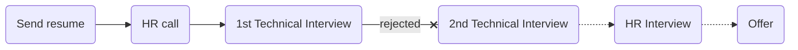

# [zibal](https://zibal.ir/)

### Status
#### 📜📞🔧❌
##  front-end developer (react - next js)
### Interview process

### Apply Way
Jobinja - linkedin

### Interview Date

- **Sent Resume**   1403.04.08

- **HR Call**  1403.04.08

- **Technical Interview**   1403.04.10 AT 1 PM

- **Rejection Email**   1403.04.16

### Interview Duration
- **Technical Interview**    30 minutes

### Interview Platform

Google Meet

### 1st Technical Interview

قبل مصاحبه فنی یه [تسک فنی](./zibal-task.pdf) بهم دادن که باید با ant design میزدم اوکی بود و منابع انسانی گفت بهم که ممکنه که  از کدی که زدی سوال کنن پس حتما مطالعه کن در کل منابع انسانی رفتار خوبی داشتن و برای ریجکتی بهم فیدبک دادن

- What is the difference between == and === in JavaScript?
- What are the various data types available in JavaScript?
- Explain the concept of hoisting in JavaScript.
- What is the purpose of the async and await keywords?
- What is the difference between `map()`, `filter()`, and `reduce()` methods in arrays?
- How do you handle errors in JavaScript?
- What are the use cases for the forEach() method in arrays?
- What is the difference between function declarations and function expressions?
Explain how event delegation works in JavaScript.
- What are `promises`, and how do they work in JavaScript?
- what is `lifecycle` in react?
- Do you know about how internet work ? dns ,...
- How do you compare` deeply nested objects` in JavaScript? Let's say we have a large object structure that keeps getting deeper. 
- do you know about `Usememo` vs `useCallback`?
- what is diffrence between `git pull` and `git merge` vs `git rebase`?

### Score
<h4><mark style="background-color:#54ca56">6/10</mark></h4>

درکل مصاحبه خوب بود چون استرسم کامل از بین رفت و روند  مصاحبه اوکی بود فقط مشکلی که داشتم با مصاحبه فنی بود خیلی رفتار حرفه ایی نداشت و به نظرم جلسه مصاحبه انلاین نباید تو محوطه باز برگزار بشه .ولی درکل ار مصاحبه خیلی مطلب یاد گرفتم

